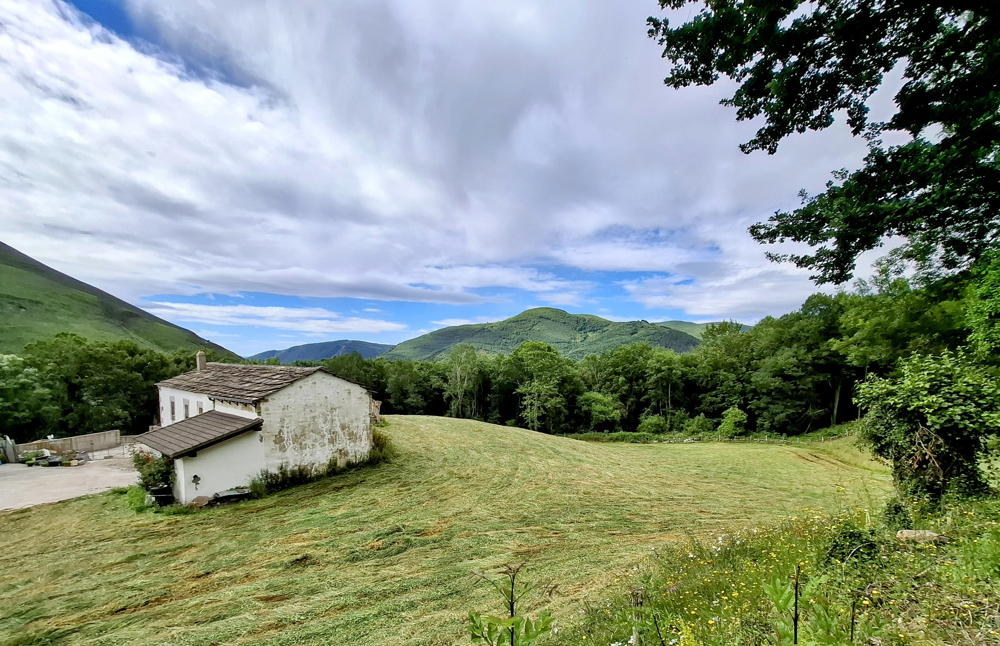
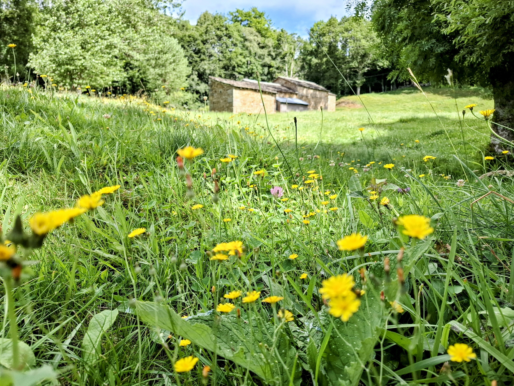
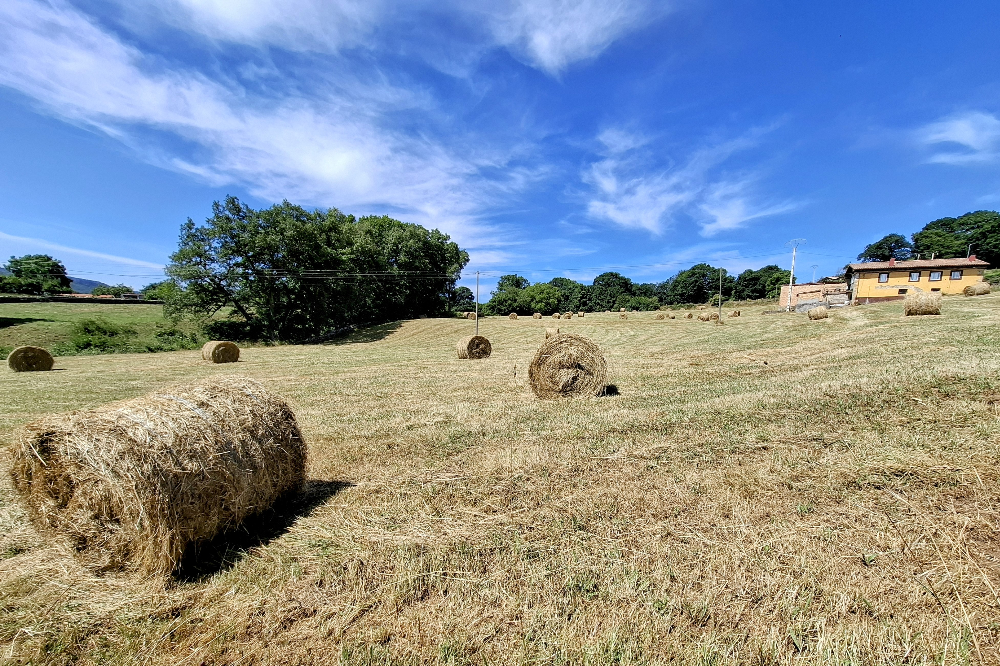
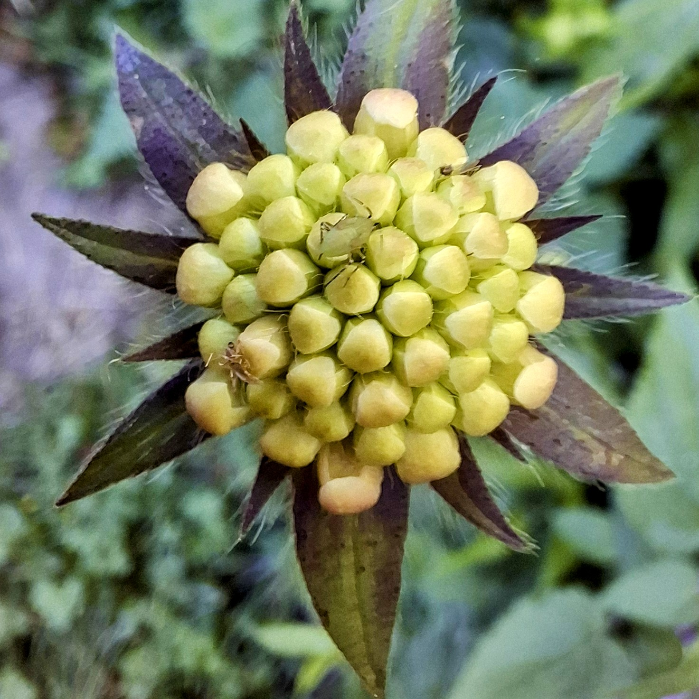
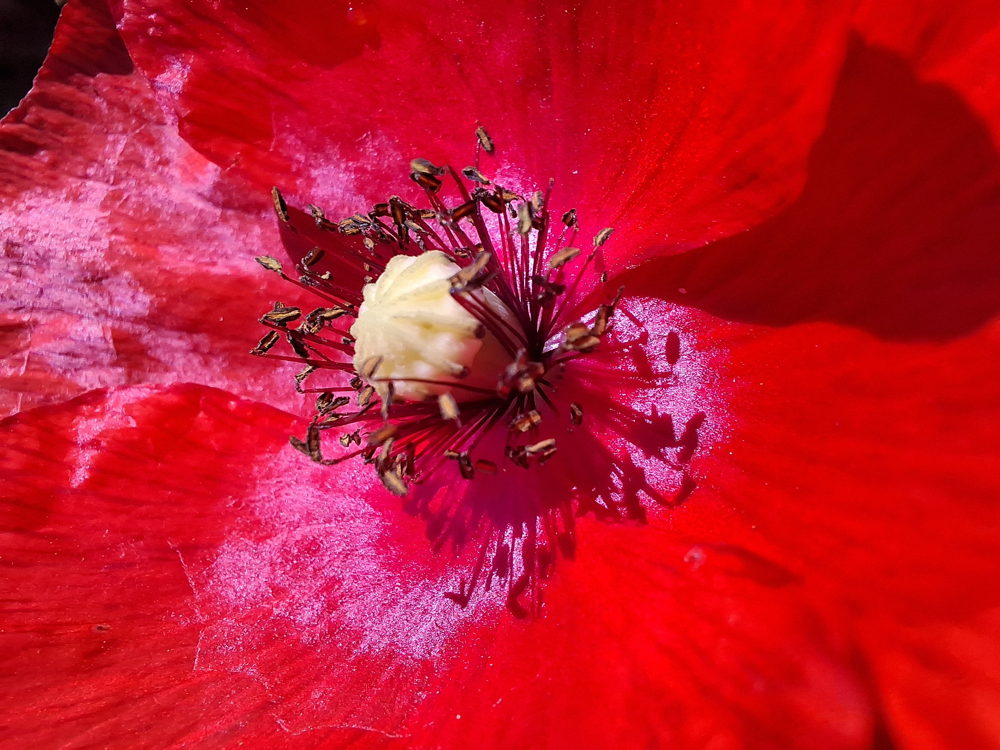
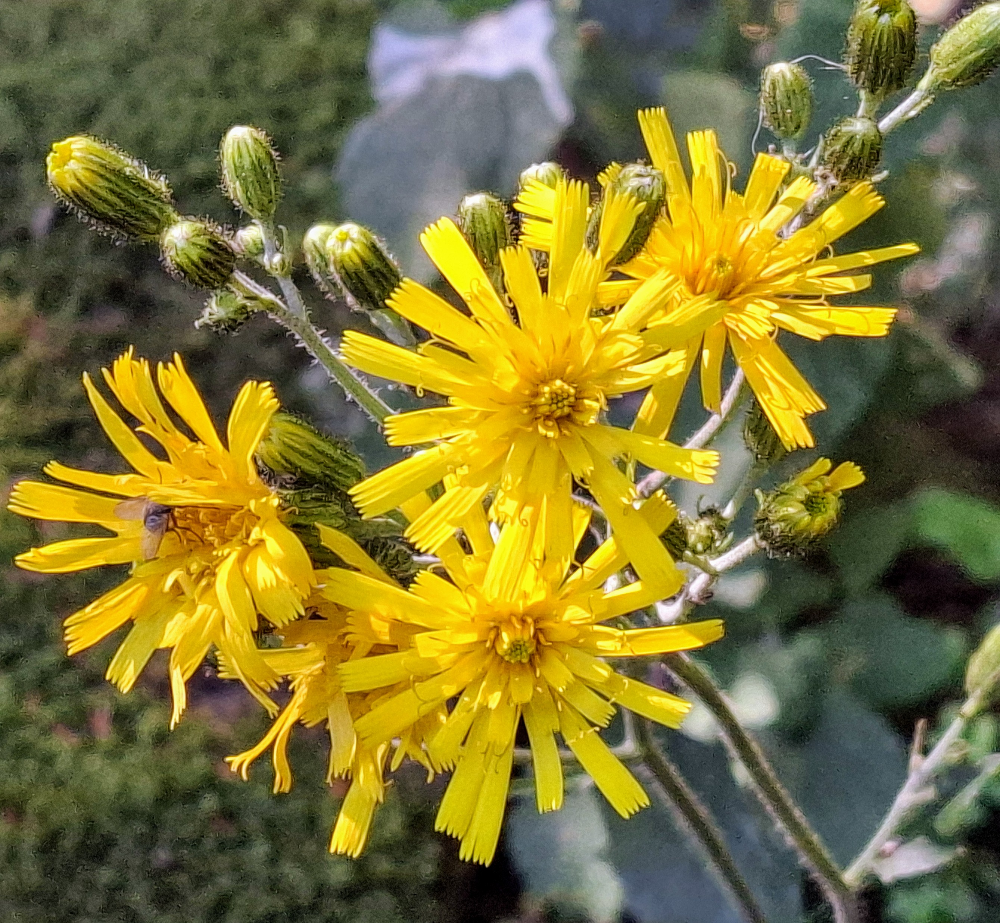
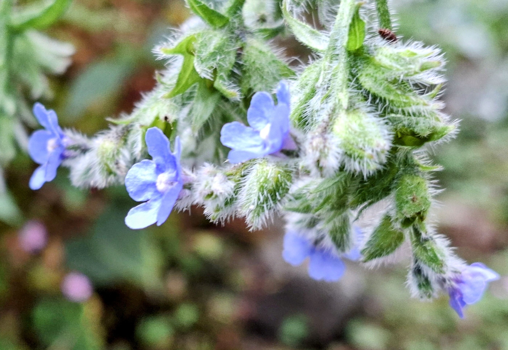
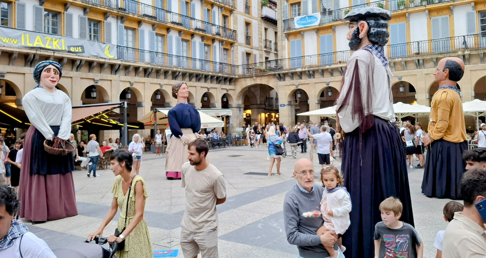

# Cantabrian Mountains

Cantabrian Mountains - Painting

{ .story-img }

Farmstead

{ .story-img }

Farmstead

{ .story-img }

Farmstead

{ .story-img }

Farmstead

{ .story-img }

Floral

{ .story-img }

Floral

{ .story-img }

Floral

{ .story-img }

Floral

{ .story-img }

Gigantes

{ .story-img }

The painting is a portmanteau of farm scenes from the Cantabrian Mountains, combining the floral abundance with the stone buildings that define rural life in this part of northern Spain. The farmsteads sit low and solid against the hills, built from the same rock they stand on, functional in a way that never needed an architect to explain.

The larger-than-life matador celebrates the gigantes mythology still celebrated in the towns and villages here. These enormous processional figures have deep roots in Spanish festival culture, and they feel right at this scale, towering over the landscape the way they tower over the crowds.

The sunflowers are a cheeky addition. I did not see them there, but I like them anyway. Not everything in a painting needs a photographic alibi.

The beautiful town of Espinosa de los Monteros is nearby. It gave the area its character, and some of that character found its way into the painting, whether I intended it to or not.

