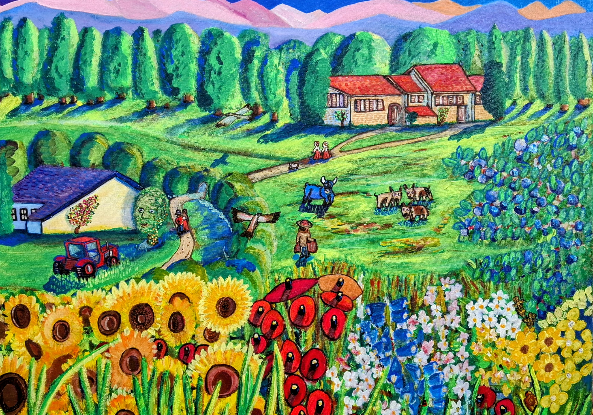

# Cantabrian Mountains

Farmstead

{ .story-img }

Meadow

{ .story-img }

Hay Bales

{ .story-img }

The Painting

{ .story-img }

Poppy

{ .story-img }

Wildflowers

{ .story-img }

Blue Flowers

{ .story-img }

Farmstead

{ .story-img }

Espinosa de los Monteros sits in a valley where the Cantabrian Mountains flatten briefly into farmland before climbing again. The photographs show what the camera always shows: stone barns with slate roofs, green fields cut for hay, wildflowers growing wherever nobody stops them. Quiet, honest countryside. The kind of place where a tractor passing counts as traffic.

The painting takes all of that and turns the volume up.

The farmsteads are still there, recognisable in their proportions and placement. Stone walls, red roof tiles, the low barns that sit into the hillside rather than standing on it. But the green of those fields, which in reality is the single uniform green of well-watered pasture, splits into a dozen variations. Emerald, lime, viridian, olive. The hills roll in colour bands that the eye reads as depth, each shade pushing the next one further back toward the mountains.

The flowers are the biggest departure. In the photographs they are incidental. A poppy here, blue borage there, yellow hawkweed catching the light. In the painting they take over the foreground entirely. Sunflowers crowd in alongside poppies and cornflowers, a combination that owes more to how the whole region felt than to any single field. The Cantabrian countryside in summer is not one meadow. It is dozens, each with its own colour bias, and the painting compresses them all into a single view.

The mountains in the background go pink and purple, which is not what they do in midday sun but is precisely what they do at the edges of the day, when the light drops and the rock faces catch whatever the sky is offering. I painted them as I remembered them from evening walks, not from the midday photographs.

The gigantes from the town square do not appear in the painting, but they were part of the same trip. Festival figures towering above the crowds, part tradition, part theatre. They capture something about northern Spain that the rural calm does not: the way communities here still gather, still celebrate with a seriousness that feels neither forced nor ironic. The farmsteads and the festivals are two sides of the same place.

This is one of the best places I have been on holiday. Rural calm, beautiful architecture and people, and lovely farmland settings. The painting is my attempt to hold all of that in a single frame.

