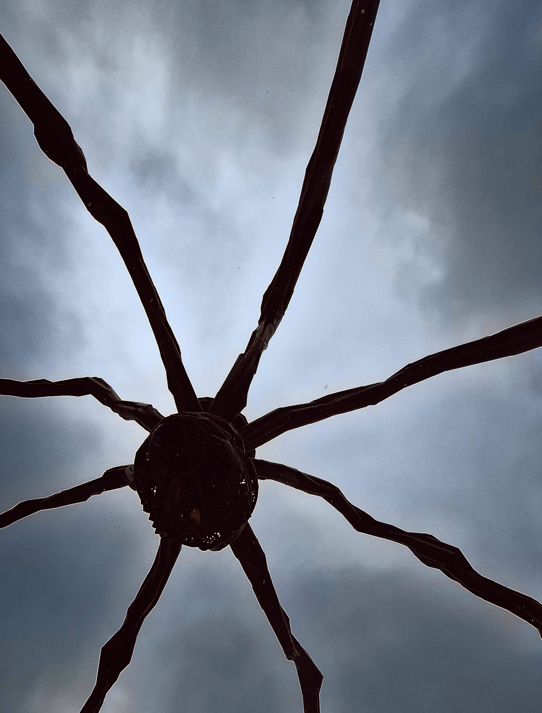
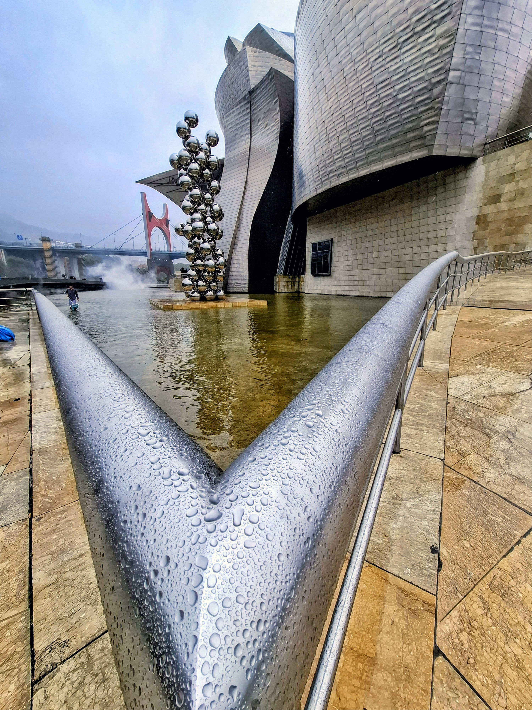
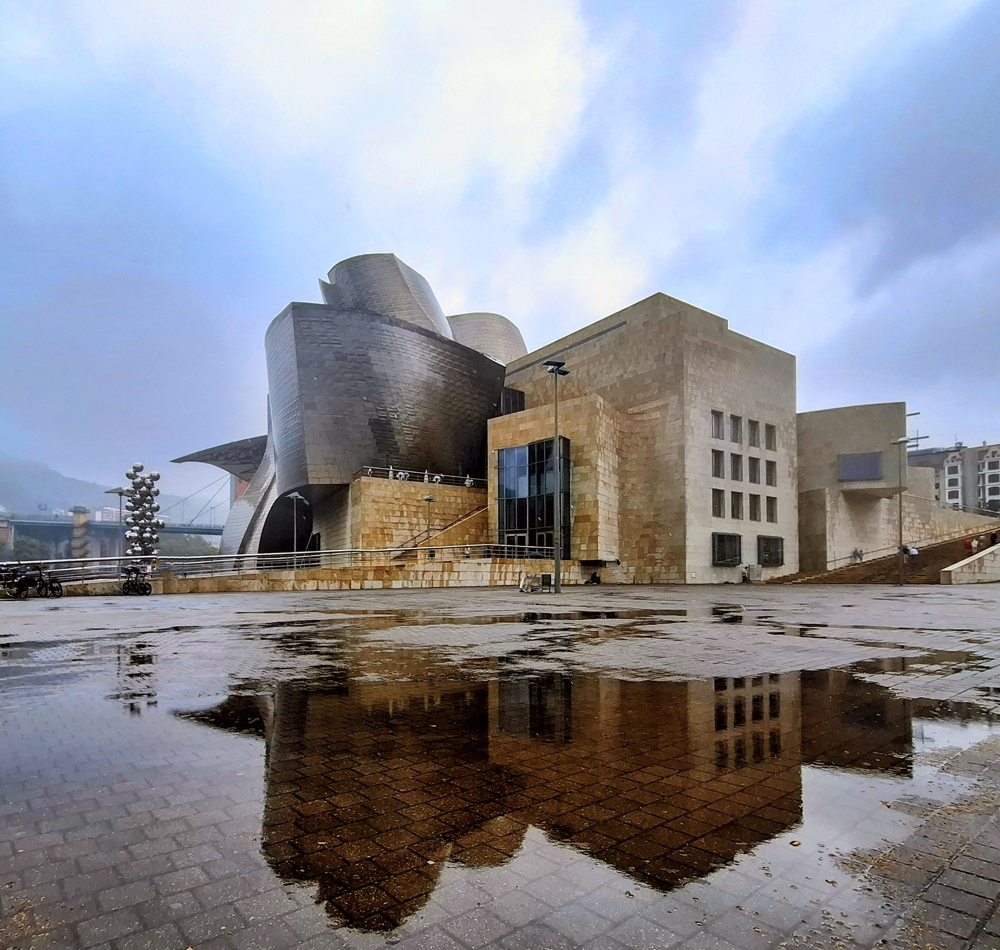

# Guggenheim

The Painting

{ .story-img }

Maman

{ .story-img }

Tall Tree and the Eye

{ .story-img }

The Museum

{ .story-img }

I chose to paint the Guggenheim because Gehry's masterpiece is a simply beautiful building. Its titanium cladding changes colour as the light shifts, imposing without overwhelming. The surrounding works provided massive inspiration: Louise Bourgeois' Maman, Anish Kapoor's Tall Tree and the Eye, Jeff Koons' Puppy, and Daniel Buren's Arku Gorriak on the Puente de la Salve.

The eyes are chained together, simply looking and seeing. The man on the mountain is appealing for things to stop, yet he's simultaneously caught up in his mobile phone, drinking coffee at the cafe, watching the scene unfold. He wants it all to pause, but he can't stop consuming it either.

