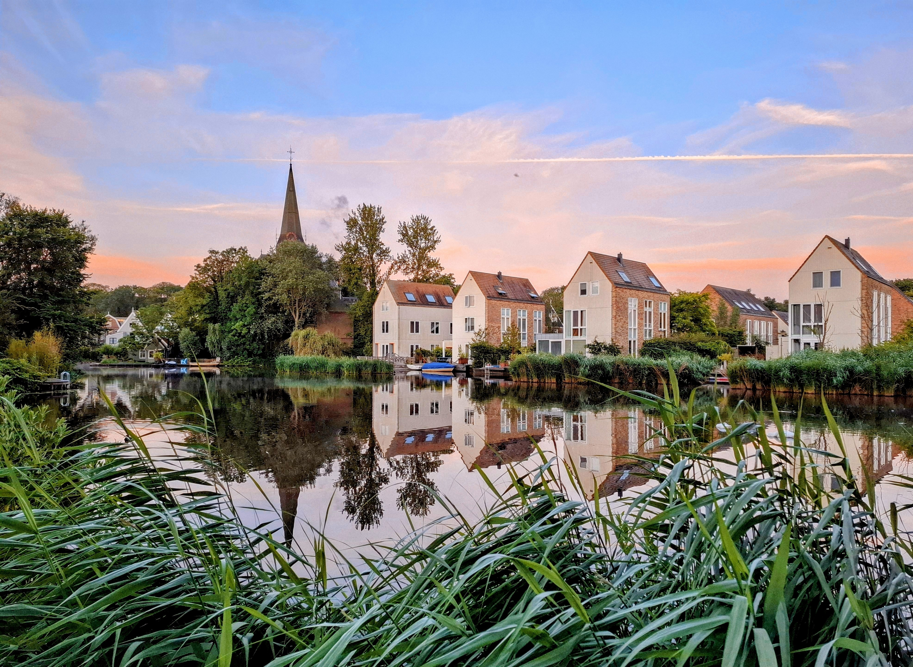

# The Last Holiday

The Scene

{ .story-img }

The Painting

{ .story-img }

The photograph gives you the scene. The painting gives you what the scene felt like.

Amsterdam Noord. Late afternoon, the light doing what it does on Dutch water. The houses sit quietly, the church spire anchors the skyline, and the canal gives everything back as a perfect mirror. A still, honest moment. And then I painted over it.

The muted Dutch palette goes. In its place: cadmium reds, cerulean blues, chrome yellows. The houses find their personality. The sky catches fire at the edges.

The reflection stays. That was non-negotiable. The canal still holds the buildings, but now it holds colour too, thick and saturated, the way water looks when you stop trying to paint it accurately and start painting it honestly.

Then the additions. A magpie lands on the church, because magpies were everywhere that trip, strutting around like they owned the place. They probably do.

The little green figure on the left, pointing. In reality it is a sign warning of children playing. In the painting it becomes something stranger, a small guardian at the edge of the frame, directing your eye inward.

And in the boat, floating calmly in the canal: ES Cargo. My snail. He turns up in most of my paintings now, a slow traveller who somehow always arrives. The name is the joke. The character is the constant.

Poppies flood the foreground because a canal bank without wildflowers felt like a lie. Daisies and sunflowers crowd in beside them. The reeds from the photograph are still there, but now they compete for space with everything else.

This is what the photo to painting process does. It is not illustration. It is translation.

