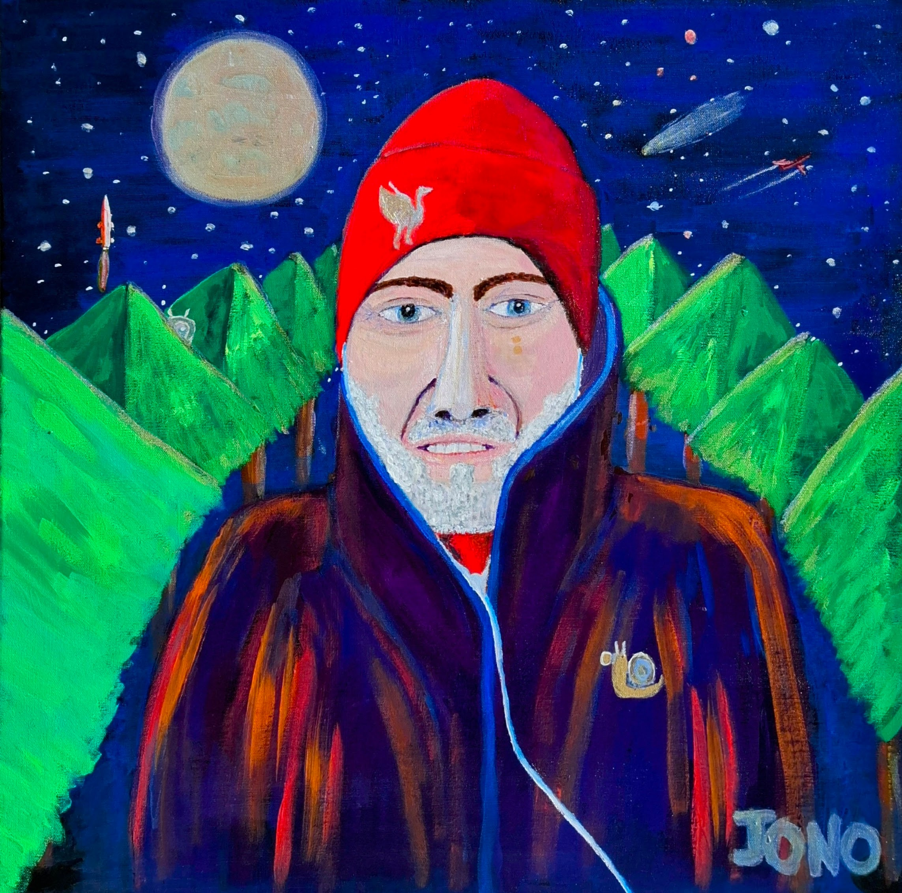

# About

{ .about-img }

I'm Jono — a painter drawn to colour, place, and the unexpected.

My work moves between acrylics and watercolours, exploring landscapes, cityscapes, and the surreal edges of everyday life. Whether it's the light over a Cape Town beach or a black hole opening up in the kitchen, I'm always chasing the moment where the familiar tips into something stranger.

I paint because it's the best way I know to make sense of the world — and to stop making sense of it.

---

*Get in touch or follow my work — more details coming soon.*
