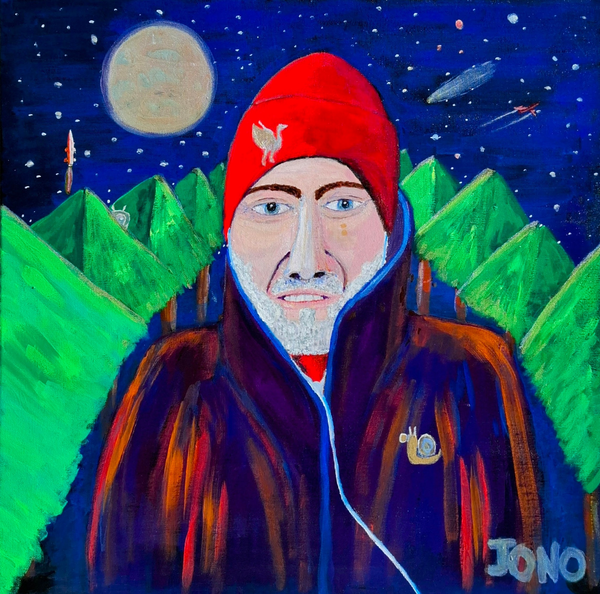

{ .hero-img }

The most unsettling realities are the ones that look normal.

These paintings sit in that space. Familiar scenes, altered just enough to feel wrong. Narratives that don't fully resolve. A world that behaves, but not quite as expected.

---

[{ .featured-img }](PhotosToPaintings/Avis%20Aeromechanica%20Chocolatus/)

### Featured Work

**Avis Aeromechanica Chocolatus**

1000mm x 750mm · Acryla Gouache
{ .card-medium }

A chocolate bird plane, built from watercolour blueprints. Part avian, part mechanical, fully impractical. The two Aero Mechanica studies were diagrams of something that could never fly. This painting built it anyway.

[Read the story](PhotosToPaintings/Avis%20Aeromechanica%20Chocolatus/){ .md-button }

---

### Rurban

Cityscapes and countryside from South Africa, Europe, and beyond.

[{ .preview-img }](landscapes.md)

[View Gallery](landscapes.md){ .md-button }

### Surreal

Where the familiar tips into something stranger.

[{ .preview-img }](surreal.md)

[View Gallery](surreal.md){ .md-button }

### Portraits

Self-portraits and studies of the human form.

[{ .preview-img }](portraits.md)

[View Gallery](portraits.md){ .md-button }

---

<a href="https://www.facebook.com/jonathan.charles.gill/" target="_blank"><i class="fa-brands fa-facebook"></i> Facebook</a>
<a href="https://www.instagram.com/jonathangi11/" target="_blank"><i class="fa-brands fa-instagram"></i> Instagram</a>

