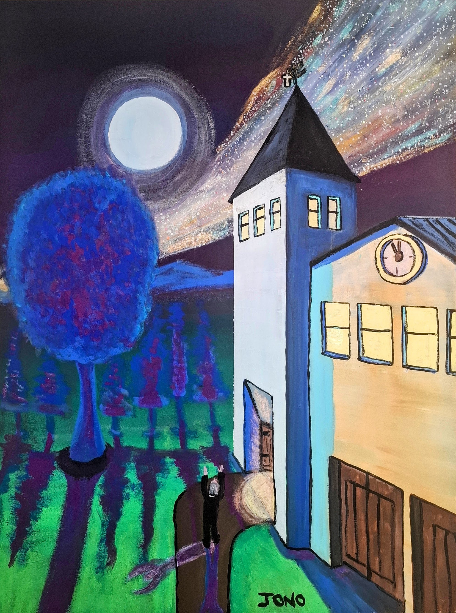
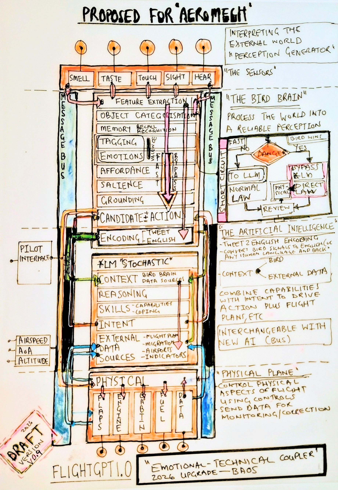
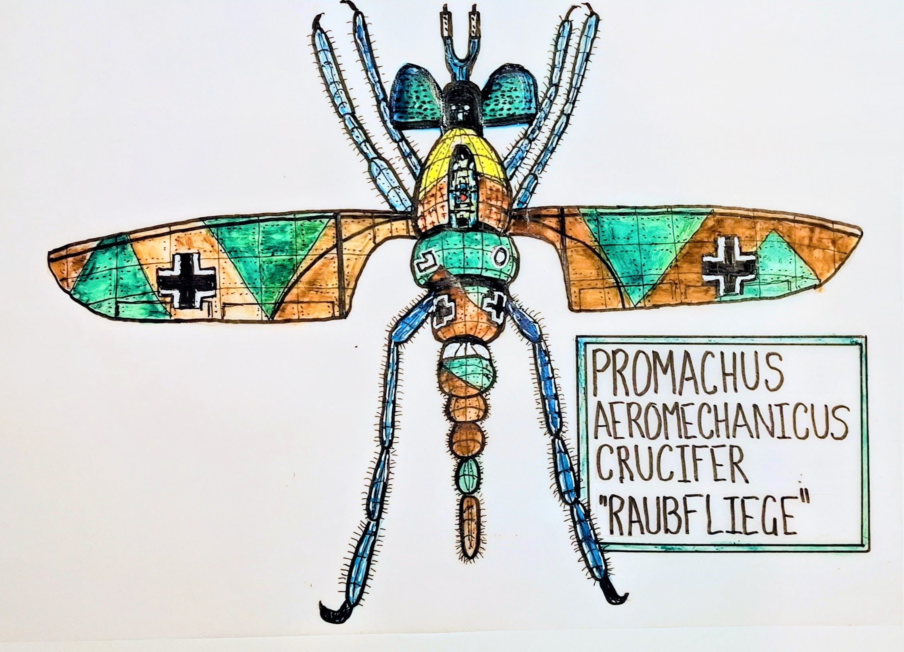
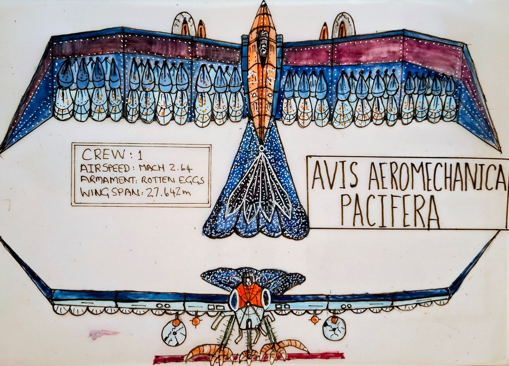
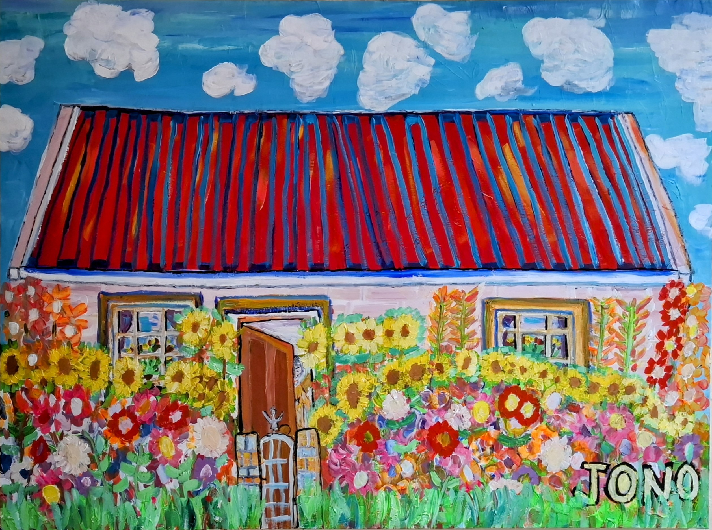
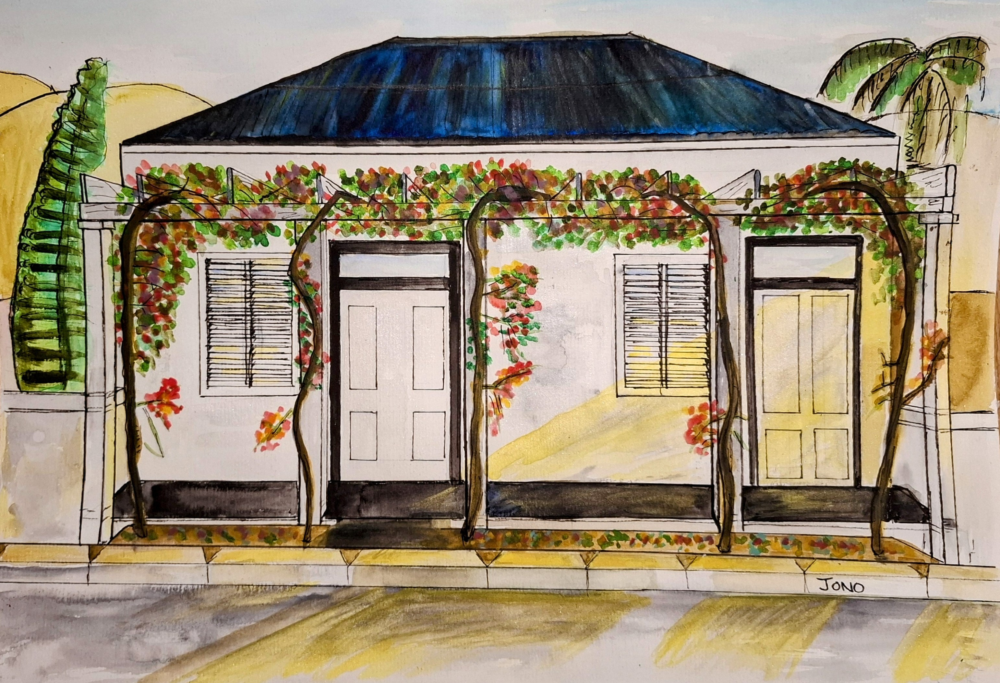
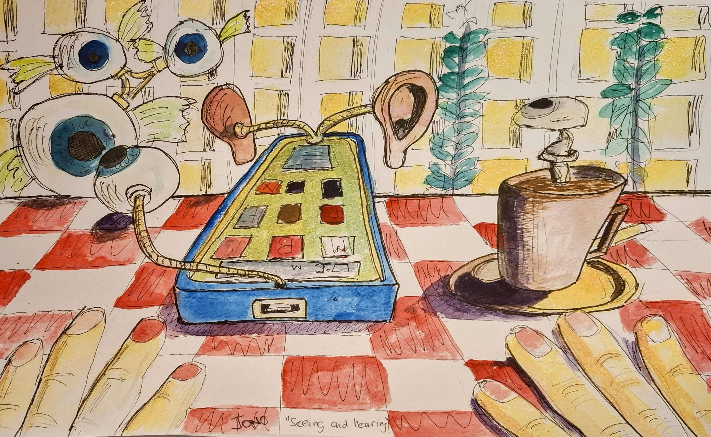

<section id="top" class="jono-hero">
  
  

  +
  +
  +
  

    

      
FIG. 01 — SERIES IN THE AIR

      
Avis Aeromechanica Chocolatus

      
Acryla Gouache · Canvas

    

    <a class="jono-hero__btn" href="#statement">Enter the gallery ↓</a>
  

</section>

<section id="statement" class="jono-statement">
  

    
§ Welcome

    <h1 class="jono-statement__head">Half engineering, half nonsense, all impractical.</h1>
  

  

    
I paint in acrylic and watercolour: birds fitted with the airframes of real aircraft, villages along Route 62, and the occasional impossible thing. Some of it is invented carefully, like a blueprint. Some of it is just what I noticed and wanted to keep.

    
This is a place to look slowly. Wander a series, read the story behind a piece, or just let the colour do the talking.

    <a class="jono-textlink" href="#aeromechanica">Start looking →</a>
  

</section>

  § The collections
  Three series

<section class="jono-series">
  

    <a class="jono-card" href="#aeromechanica">
      

        
      

      
01

      <h3 class="jono-card__title">Aeromechanica</h3>
      
Creatures fitted with the airframes of real aircraft.

    </a>
    <a class="jono-card" href="#rurban">
      

        
      

      
02

      <h3 class="jono-card__title">Rurban</h3>
      
Buildings, hills, and the occasional tree.

    </a>
    <a class="jono-card" href="#surreal">
      

        
      

      
03

      <h3 class="jono-card__title">Surreal</h3>
      
Where the brush wanders off the map.

    </a>
  

</section>

<section id="aeromechanica" class="jono-aero">
  

    
§ 01 — Aeromechanica

    

      <h2 class="jono-h2">From the WWII air wars, fought by aeromechanica insects to modern commercial jets powered by cocoa.</h2>
      
Creatures fitted with the airframes of real aircraft. Some carry RAF roundels, some Luftwaffe Balkenkreuze. A small war fought by birds, beetles, mosquitos, robber flies and hornets. A commercial, passenger-carrying, biomechanical plane, using large language models. Half engineering, half nonsense, all impractical.

    

    

      
FlightGPT — a bird brain and language model, coupled

      

        

          
        

        

          
        

      

      

        

          <h3 class="jono-evo__title">FlightGPT</h3>
          
Watercolour · Paper

        

        
A bird brain and language model combination, designed to power a biomechanical aircraft. The senses feed a perception builder, the language model mixes reality against the flight plan, and the physical controls translate it all into wings, cabin and fuel.

      

    

    

      
The drawings — origin, airframe, cockpit

      

        

          

          <h3 class="jono-item__title">Aeromechanica (side profile)</h3>
          
A4 · Watercolour · Hot Press

          
Side elevation. ILS trees on either side of the runway. Annotated for free flight, slurp, smoothie and feed.

        

        

          

          <h3 class="jono-item__title">Aeromechanica (top profile)</h3>
          
A3 · Watercolour · Hot Press

          
Top elevation. The high-nutrition bypass propulsion engine, with mixer, microwave and CO2 extractor.

        

        

          

          <h3 class="jono-item__title">Aeromechanica Chocolatus Airframe Cutaway</h3>
          
A3 · Ink, Pastel &amp; Watercolour

          
A cutaway of the airframe. The structure follows a bird's rib strategy, with the wings mounted to the airframe and driven by the Flaperon Engine. Fuel is carried in bags. The Dove Tail keeps the flight stable.

        

        

          

          <h3 class="jono-item__title">Aeromechanica Chocolatus Cockpit</h3>
          
Watercolour &amp; Ink · Paper

          
The control panel of the Chocolatus. Emergency feeding draws from the seed and cacao reserves. The bird brain, the flightGPT LLM and Foodec are all marshalled from here.

        

      

    

    

      
The squadron — allied, axis, jet age

      

        

          
Allied

          <h3 class="jono-item__title">Lucanus Aeromechanica Avronis</h3>
          
A4 · Watercolour  · Vellum

          
A stag beetle on the airframe of an Avro. Mandibles up, RAF roundels, bombs slung beneath.

        

        

          
Allied

          <h3 class="jono-item__title">Culex Aeromechanica De Havillandii</h3>
          
A4 · Watercolour  · Vellum

          
A mosquito turned De Havilland Mosquito. Two Merlins, three crew, RAF roundels.

        

        

          
Allied

          <h3 class="jono-item__title">Libellula Aviatica</h3>
          
Acryla Gouache · Canvas

          
A dragonfly given the airframe of a biplane. Two pairs of wings, a twin tail, RAF roundels.

        

        

          
Axis

          <h3 class="jono-item__title">Promachus Aeromechanicus Crucifer</h3>
          
A4 · Watercolour · Vellum

          
A robber fly with cruciform wings and Balkenkreuze. Predator built like a fighter.

        

        

          
Axis

          <h3 class="jono-item__title">Avis Aeromechanica Crabro</h3>
          
A4 · Watercolour  · Vellum

          
A hornet on a Bf 109 nose. Six legs, Luftwaffe markings, fuselage 13.

        

        

          
Jet Age

          <h3 class="jono-item__title">Avis Aeromechanica Paciferus</h3>
          
A4 · Watercolour  · Vellum

          
A bird with swept gull-wing wings and a 27.642m span. Mach 2.64, crew of one, armed with rotten eggs.

        

      

    

  

</section>

<section id="rurban" class="jono-rurban">
  
§ 02 — Rurban

  

    <h2 class="jono-h2">Buildings, hills, and the occasional tree.</h2>
    
Scenes reduced to what I actually noticed. Route 62 country, the harbours of False Bay, and a few places further afield that asked to be painted.

  

  

    

    

      <h3 class="title">The Road to Somewhere <em>(Part One)</em></h3>
      
1000 × 750 mm · Canvas

      
Reimagining the R62. Sometimes on life's journey we reach a destination that brings joy, abundant fruit, colour, a beautiful house at the end of the road. The journey to Know Where is not over, but this is a good stopping point.

    

  

  

    

      

      <h3 class="jono-item__title">Cantabrian Mountains</h3>
      
1000 × 750 mm · Canvas

      
A rural farm setting near Espinosa de los Monteros. One of the best places I have been on holiday.

    

    

      

      <h3 class="jono-item__title">Suurbraak</h3>
      
1000 × 750 mm · Canvas

      
A charming village near Swellendam.

    

    

      

      <h3 class="jono-item__title">The Last Holiday, Amsterdam</h3>
      
1000 × 750 mm · Canvas

      
Overlooking a pond in Amsterdam Noord. A lot of small but interesting things to see, if you look for them.

    

  

  

    
Watercolours on paper

    

      

        

        <h3 class="jono-item__title">St James</h3>
        
A3 · Watercolour

      

      

        

        <h3 class="jono-item__title">Bo-Kaap</h3>
        
A3 · Watercolour

      

      

        

        <h3 class="jono-item__title">Montagu</h3>
        
A3 · Watercolour

      

    

  

</section>

<section id="surreal" class="jono-surreal">
  
§ 03 — Surreal

  

    <h2 class="jono-h2">Where the brush wanders off the map.</h2>
    
I start with what I see and what I hear. Then I paint, and the painting starts making its own decisions. Colours push harder, geometry tightens, and what was a real place becomes something that was always hiding inside it.

  

  

    

    

      <h3 class="title">A Starling's Reformation at Five to Midnight</h3>
      
750 × 1000 mm · Holbein Acryla Gouache · Canvas

      
A reflection on the way nature can take from us, often without warning, even the things we value most. No authority, influence or urgency can reclaim what has been lost once time begins to run out. To me it is about universal reckoning, and the limits of human control.

    

  

  

    

      

      <h3 class="jono-item__title">Bilbao, Guggenheim Museum</h3>
      
750 × 1000 mm · Acryla Gouache · Canvas

      
Elevating the titanium-clad building and its art to new levels.

    

    

      

      <h3 class="jono-item__title">The Grand Insect Hotel</h3>
      
750 × 1000 mm · Acryla Gouache · Canvas

      
The official painting commemorating The Insect Hotel.

    

    

      

      <h3 class="jono-item__title">The Road to Know Where?</h3>
      
Holbein Acryla Gouache · Canvas

      
At a crossroads. A path chosen, but the destination unknown.

    

    

      

      <h3 class="jono-item__title">The Love Vending Machine</h3>
      
1500 × 2000 mm · Acryla Gouache · Canvas

      
Channelling the positive energy of the Universe into human endeavours.

    

  

  

    
Watercolours on paper

    

      

        

        <h3 class="jono-item__title">Sir Real</h3>
        
A3 · Watercolour

      

      

        

        <h3 class="jono-item__title">Eye Field</h3>
        
A3 · Watercolour

      

      

        

        <h3 class="jono-item__title">Listening</h3>
        
A3 · Watercolour

      

    

  

</section>

<section class="jono-morework">
  

    
§ More to see

    <h2 class="jono-h2">This is a selection. There is more.</h2>
    
The villages and harbours, the surreal pieces and the portraits, the watercolours that did not fit above. The full collection lives on its own page.

    <a class="jono-textlink" href="/collection/">Browse the full collection →</a>
  

</section>

<section id="stories" class="jono-stories">
  

    § Stories
    The longer reads
  

  <h2 class="jono-stories__h2">The places and ideas behind the paintings.</h2>
  

    <a class="jono-storyrow" href="/stories/Cantabrian%20Mountains/" target="_blank" rel="noopener">
      01
      Cantabrian Mountains
      Read →
    </a>
    <a class="jono-storyrow" href="/stories/The%20Last%20Holiday/" target="_blank" rel="noopener">
      02
      The Last Holiday, Amsterdam
      Read →
    </a>
    <a class="jono-storyrow" href="/stories/The-Road-to-Know-Where/" target="_blank" rel="noopener">
      03
      The Road to Know Where
      Read →
    </a>
    <a class="jono-storyrow" href="/stories/Guggenheim/" target="_blank" rel="noopener">
      04
      Guggenheim, Bilbao
      Read →
    </a>
    <a class="jono-storyrow" href="/stories/The%20Insect%20Hotel/" target="_blank" rel="noopener">
      05
      The Grand Insect Hotel
      Read →
    </a>
  

</section>

<section id="about" class="jono-about">
  

    

      
§ About Jono

      
I draw before I paint (a blueprint, a cutaway, an annotation), and then I let the colour break the rules the drawing set.

      
I work in acrylic, Holbein Acryla Gouache and watercolour. Mostly from the Western Cape: the villages along Route 62, the harbours after rain, the light on a hillside. I draw the plan first, then let the colour disobey it. None of the images here are AI-generated. Every piece is a physical object, real paint on real canvas or paper.

      
I also write. The essays here are not about art. They are about the things I care enough to write down: governance, technology, and how institutions work or fail to.

      <a class="jono-textlink" href="/essays/">Read the essays →</a>
    

    

      
Originals &amp; prints

      
Most pieces are available as originals or prints. There is no pressure to buy. If something here speaks to you, send a message and we can talk about it.

      <a class="jono-cta" href="https://www.instagram.com/jonathangi11/" target="_blank" rel="noopener">Enquire about a piece →</a>
      

        <a href="https://www.instagram.com/jonathangi11/" target="_blank" rel="noopener">Instagram</a>
        <a href="https://www.facebook.com/jonathan.charles.gill/" target="_blank" rel="noopener">Facebook</a>
      

    

  

</section>
