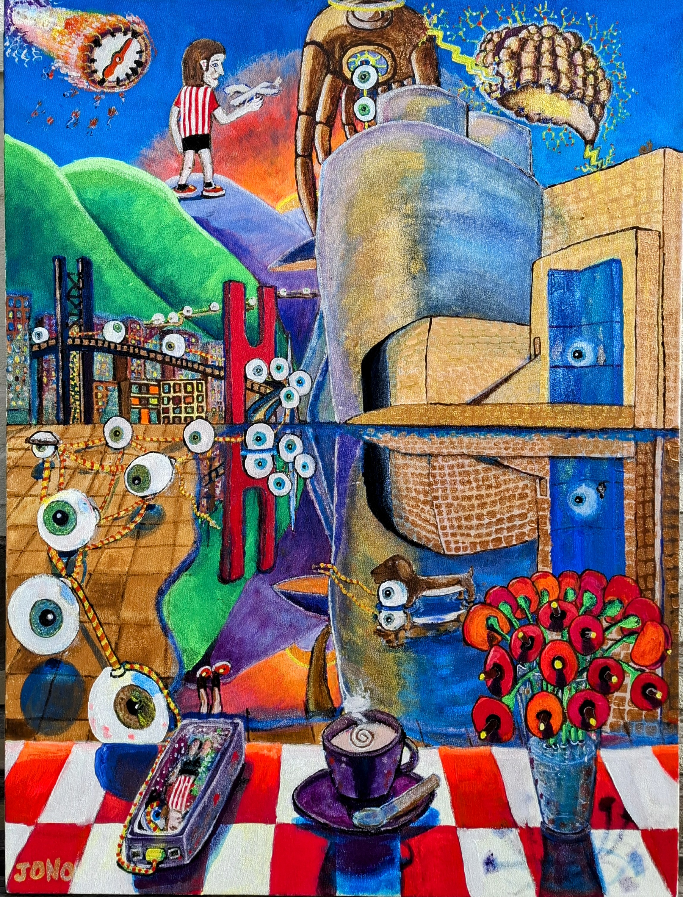
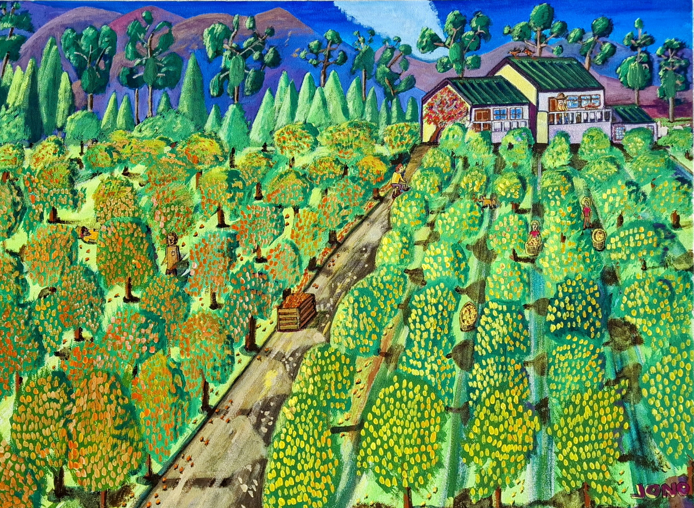

# Landscapes

Cityscapes and countryside painted in acrylics and watercolours.

---

{ .gallery-img }

**St James**
{ .card-medium }

<!-- Add your description here -->

{ .gallery-img }

**Bilboa**
{ .card-medium }

<!-- Add your description here -->

{ .gallery-img }

**The Last Holiday, Amsterdam**
{ .card-medium }

<!-- Add your description here -->

{ .gallery-img }

**Amsterdam**
{ .card-medium }

<!-- Add your description here -->

{ .gallery-img }

**Suurbraak**
{ .card-medium }

<!-- Add your description here -->

{ .gallery-img }

**Suurbraak 1**
{ .card-medium }

<!-- Add your description here -->

{ .gallery-img }

**Suurbraak 2**
{ .card-medium }

<!-- Add your description here -->

{ .gallery-img }

**Suurbraak 3**
{ .card-medium }

<!-- Add your description here -->

{ .gallery-img }

**Suurbraak 4**
{ .card-medium }

<!-- Add your description here -->

{ .gallery-img }

**Suurbraak 5**
{ .card-medium }

<!-- Add your description here -->

{ .gallery-img }

**Bo-Kaap**
{ .card-medium }

<!-- Add your description here -->

{ .gallery-img }

**Simons Town 1**
{ .card-medium }

<!-- Add your description here -->

{ .gallery-img }

**Simons Town 2**
{ .card-medium }

<!-- Add your description here -->

{ .gallery-img }

**Woodstock**
{ .card-medium }

<!-- Add your description here -->

{ .gallery-img }

**Orchards**
{ .card-medium }

<!-- Add your description here -->

{ .gallery-img }

**Orchard 2**
{ .card-medium }

<!-- Add your description here -->

{ .gallery-img }

**Lavenders, Franschhoek**
{ .card-medium }

<!-- Add your description here -->

{ .gallery-img }

**McGregor**
{ .card-medium }

<!-- Add your description here -->

{ .gallery-img }

**Montagu**
{ .card-medium }

<!-- Add your description here -->

{ .gallery-img }

**Swellendam**
{ .card-medium }

<!-- Add your description here -->

{ .gallery-img }

**Liewe Hier**
{ .card-medium }

<!-- Add your description here -->

{ .gallery-img }

**The Path**
{ .card-medium }

<!-- Add your description here -->

{ .gallery-img }

**Dunnets Head**
{ .card-medium }

<!-- Add your description here -->

{ .gallery-img }

**Rotterdam**
{ .card-medium }

<!-- Add your description here -->

{ .gallery-img }

**The Hague**
{ .card-medium }

<!-- Add your description here -->

