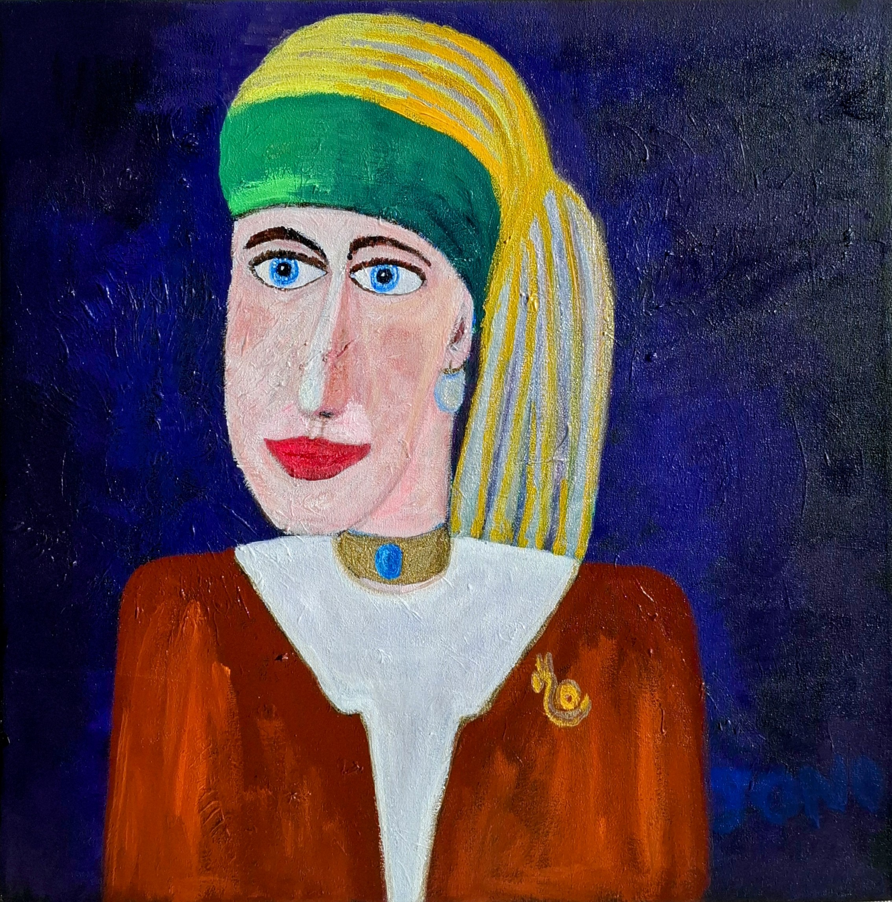

# Portraits

Self-portraits and studies of the human form.

---

{ .gallery-img }

**Catching the Cold in Amsterdam**

Canvas
{ .card-medium }

A self-portrait.

{ .gallery-img }

**Jono**

A3 · Watercolour · 300gsm Hot Press Paper
{ .card-medium }

Another self-portrait.

{ .gallery-img }

**The Girl with the Plastic Earrings**

Canvas
{ .card-medium }

A cheeky take on The Girl with the Pearl Earring by Vermeer. Perhaps the Girl with the Plastic Earring by Jono.

---

<a href="https://www.facebook.com/jonathan.charles.gill/" target="_blank"><i class="fa-brands fa-facebook"></i> Facebook</a>
<a href="https://www.instagram.com/jonathangi11/" target="_blank"><i class="fa-brands fa-instagram"></i> Instagram</a>

