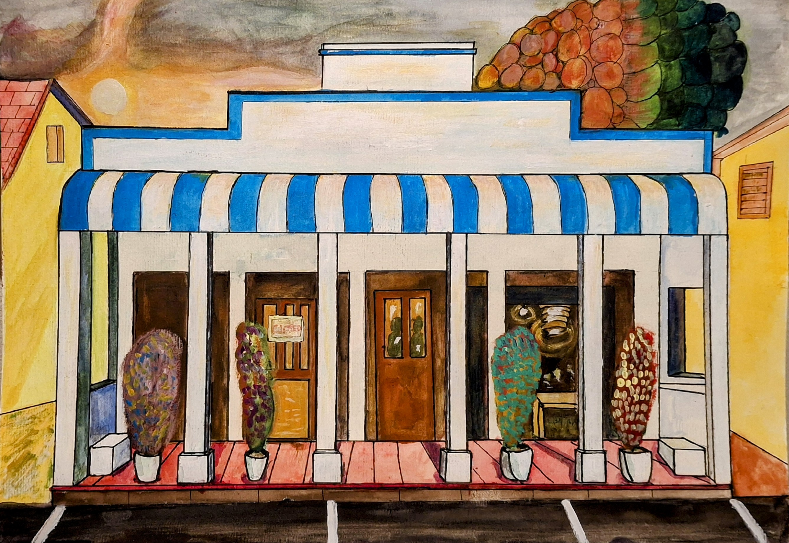
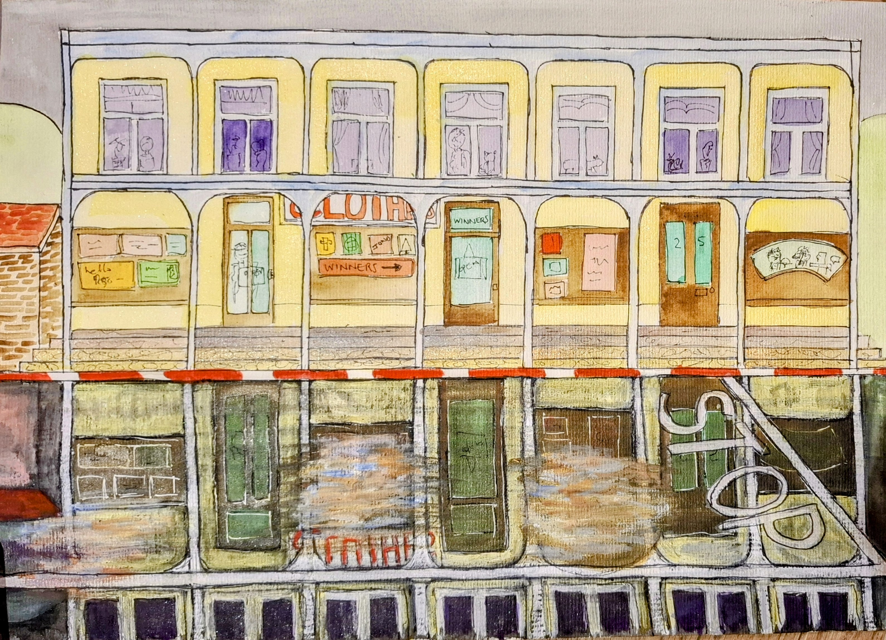
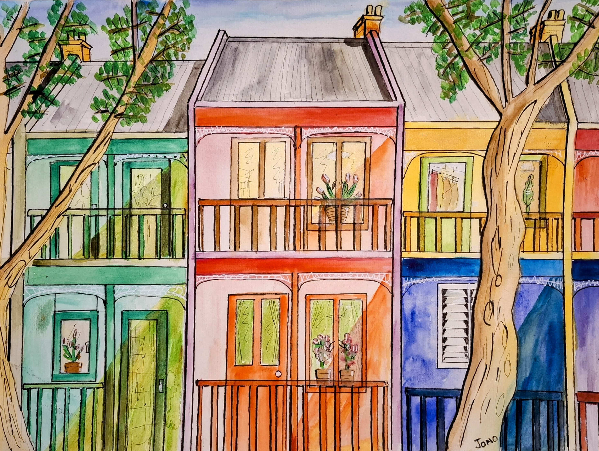
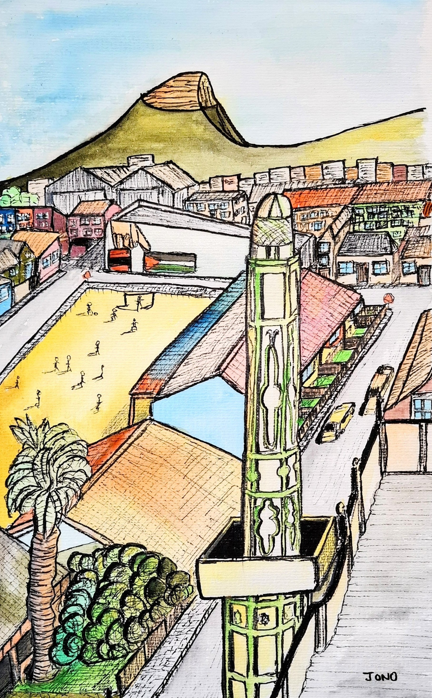

# Rurban

Buildings, hills, and the occasional tree, scenes reduced to what I actually noticed.

---

{ .gallery-img loading=lazy }

**The Road to Somewhere (Part One)**

1000mm x 750mm · Canvas
{ .card-medium }

Reimagining the R62.

Sometimes on life's journey, we reach a destination that brings joy, abundant fruit, colour, a beautiful house at the end of the road. The journey to Know Where is not over, but this is a good stopping point, a chance to reset and think.

{ .gallery-img loading=lazy }

**Cantabrian Mountains**

1000mm x 750mm · Acryla Gouache · Canvas
{ .card-medium }

A rural farm setting near Espinosa de los Monteros. One of the best places I have been on holiday.

[Read the story](stories/Cantabrian%20Mountains/index.md){ .card-story-link }

{ .gallery-img loading=lazy }

**Suurbraak**

1000mm x 750mm · Acrylic & Acryla Gouache · Canvas
{ .card-medium }

A charming village near Swellendam.

{ .gallery-img loading=lazy }

**The Last Holiday, Amsterdam**

1000mm x 750mm · Acryla Gouache · Canvas
{ .card-medium }

Overlooking a pond in Amsterdam Noord. Amsterdam has a lot of small, but interesting things to see, if you look for them.

[Read the story](stories/The%20Last%20Holiday/index.md){ .card-story-link }

---

{ .gallery-img loading=lazy }

**22 on Church**

A3 · Watercolour · 300gsm Hot Press Paper
{ .card-medium }

A charming restaurant in Montagu, serving up delicious food. One of my personal favourite restaurants.

{ .gallery-img loading=lazy }

**Amsterdam**

A3 · Watercolour · 300gsm Hot Press Paper
{ .card-medium }

The flower blossoms add to the beauty of Amsterdam.

{ .gallery-img loading=lazy }

**Ancienne Mosquee du Vendredi Banjanani**

A3 · Watercolour · 300gsm Hot Press Paper
{ .card-medium }

{ .gallery-img loading=lazy }

**Bo-Kaap**

A3 · Watercolour · 300gsm Hot Press Paper
{ .card-medium }

{ .gallery-img loading=lazy }

**Cafe T'Sluisje**

A3 · Watercolour · 300gsm Hot Press Paper
{ .card-medium }

A lovely cafe on the canals in Amsterdam Noord.

{ .gallery-img loading=lazy }

**Dunnets Head Lighthouse**

A3 · Watercolour · 300gsm Hot Press Paper
{ .card-medium }

{ .gallery-img loading=lazy }

**Lavenders in Franschhoek**

A3 · Watercolour · 300gsm Hot Press Paper
{ .card-medium }

The lavender field and charming cottage, on the way into Franschhoek, are a must-see.

{ .gallery-img loading=lazy }

**Liewe Hier**

A3 · Watercolour · 300gsm Hot Press Paper
{ .card-medium }

{ .gallery-img loading=lazy }

**McGregor**

A3 · Watercolour · 300gsm Hot Press Paper
{ .card-medium }

A village that time forgot, at the end of a road that doesn't go anywhere else.

{ .gallery-img loading=lazy }

**McGregor NG Kerk**

A3 · Watercolour · 300gsm Hot Press Paper
{ .card-medium }

{ .gallery-img loading=lazy }

**Montagu**

A3 · Watercolour · 300gsm Hot Press Paper
{ .card-medium }

Route 62 country. Mountains and Victorian storefronts.

{ .gallery-img loading=lazy }

**R62 - Prickly Pear Farm**

A3 · Watercolour · 300gsm Hot Press Paper
{ .card-medium }

{ .gallery-img loading=lazy }

**Rotterdam**

A3 · Watercolour · 300gsm Hot Press Paper
{ .card-medium }

{ .gallery-img loading=lazy }

**Simons Town**

A3 · Watercolour · 300gsm Hot Press Paper
{ .card-medium }

A naval town with more character than it gets credit for.

{ .gallery-img loading=lazy }

**Simons Town**

A3 · Watercolour · 300gsm Hot Press Paper
{ .card-medium }

The architecture reflections in the puddles after rain are amazing.

{ .gallery-img loading=lazy }

**Spanish Windows**

A3 · Watercolour · 300gsm Hot Press Paper
{ .card-medium }

The windows of Espinosa de los Monteros.

{ .gallery-img loading=lazy }

**St James**

A3 · Watercolour · 300gsm Hot Press Paper
{ .card-medium }

St James lies between Muizenburg and Kalk Bay. The colourful huts are a magnet for painting.

{ .gallery-img loading=lazy }

**Suurbraak**

A3 · Watercolour · 300gsm Hot Press Paper
{ .card-medium }

{ .gallery-img loading=lazy }

**Swellendam**

A3 · Watercolour · 300gsm Hot Press Paper
{ .card-medium }

{ .gallery-img loading=lazy }

**The Hague**

A3 · Watercolour · 300gsm Hot Press Paper
{ .card-medium }

{ .gallery-img loading=lazy }

**Ultimo**

A3 · Watercolour · 300gsm Hot Press Paper
{ .card-medium }

Ultimo in Sydney.

{ .gallery-img loading=lazy }

**Woodstock**

A3 · Watercolour · 300gsm Hot Press Paper
{ .card-medium }

---

<a href="https://www.facebook.com/jonathan.charles.gill/" target="_blank"><i class="fa-brands fa-facebook"></i> Facebook</a>
<a href="https://www.instagram.com/jonathangi11/" target="_blank"><i class="fa-brands fa-instagram"></i> Instagram</a>

