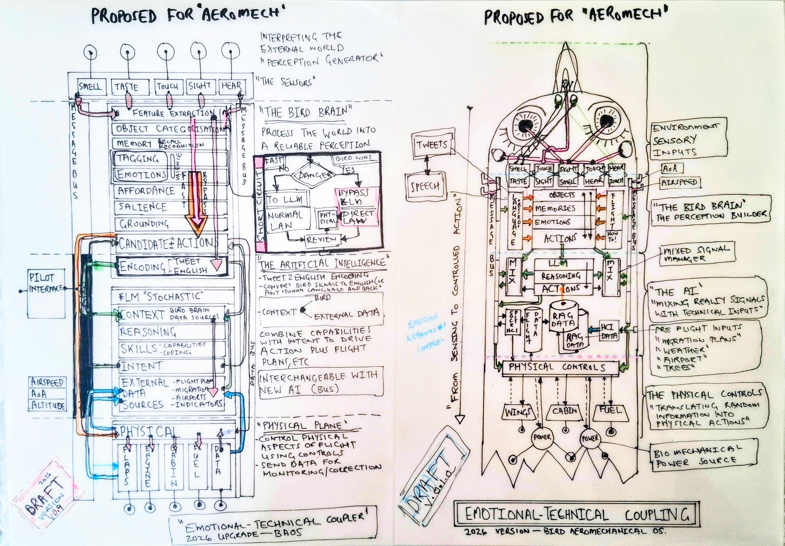

# Avis Aeromechanica Chocolatus

The Painting

{ .story-img }

Blueprint 1

{ .story-img }

Blueprint 2

{ .story-img }

Emotional-Technical Coupling

{ .story-img }

The two watercolour blueprints came first. Aero Mechanica 1 and 2 were studies in how a bird might work if it were engineered rather than evolved. Part avian, part mechanical, drawn out in the way you would plan a machine: elevations, cross-sections, annotations that look technical but are not.

The acryla gouache painting took those blueprints and built the thing. Chocolate brown and warm ochre replaced the watercolour washes. The bird plane gained weight and presence. What had been a diagram became an object, sitting in space, casting shadow.

The name says what it is. Avis, bird. Aeromechanica, a machine that flies. Chocolatus, because the palette landed there and stayed. A biomechanical bird plane rendered in the colours of cocoa and caramel, somewhere between technical drawing and confectionery.

The coupling sheets came later. Two ink drawings on A4 vellum, set over the brains of the plane. They work out how the bird's own brain interconnects with the AI that flies the aircraft. One side traces the emotional responses of the bird as it reads its environment: light, weather, threat, the pull of altitude. The other side is the AI, populated with flight data and external feeds, plotting what the machine knows. The drawings sit between the two and ask how feeling and data meet, and which one decides.

