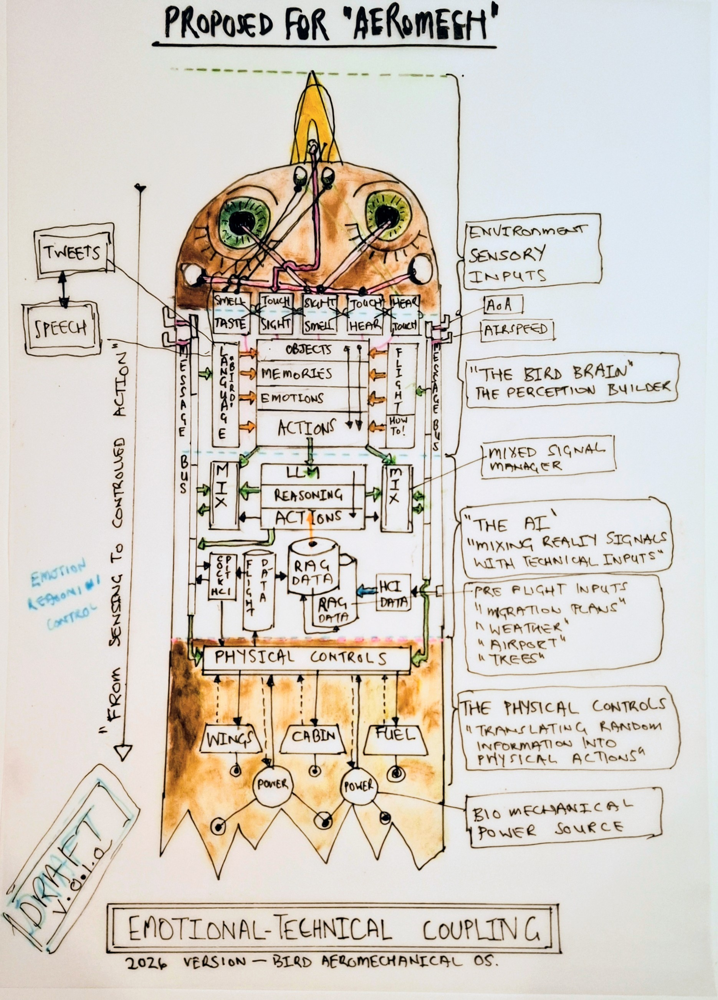
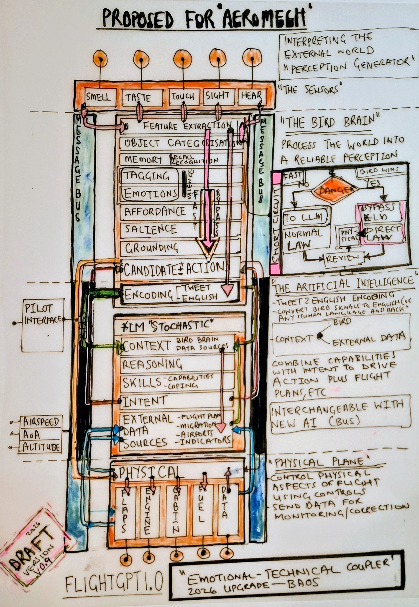

# Avis Aeromechanica Chocolatus

The two watercolour blueprints came first. A side profile and a top profile, studies in how a bird might work if it were engineered rather than evolved. Part avian, part mechanical, drawn out the way you would plan a machine: elevations, cross-sections, annotations that look technical because they are. The wings are still feathered. The propulsion engine runs on chocolate, fats, greens and protein, mixes them in a microwave, and vents through a CO2 extractor that is a literal pot plant. ILS trees stand on either side of the runway.

Side Profile

A3 · Watercolour · 300gsm Hot Press

{ .story-img }

Top Profile

A3 · Watercolour · 300gsm Hot Press

{ .story-img }

The acryla gouache painting took those blueprints and built the thing. A bright orange livery and pink wings replaced the watercolour washes. The bird plane gained weight and presence. What had been a diagram became an object, sitting in space, casting shadow.

The name says what it is. Avis, bird. Aeromechanica, a machine that flies. Chocolatus, because chocolate is its fuel. The orange livery is there because orange is a bright, cheerful colour, and a bird plane that runs on chocolate ought to look the part.

The painting also puts the bird plane somewhere. A lighthouse, a beach at sunset, a container ship on the horizon, two figures at the waterline, a foreground that reads as either a fence or a wave. The blueprints sat on white paper and refused to commit. The painting commits. It puts the impossible thing in a real place, and lets the place do the work.

Avis Aeromechanica Chocolatus

1000mm × 750mm · Acryla Gouache · Canvas

{ .story-img }

The integration drawings came later. FlightGPT 0.4 and FlightGPT 1.0 are two passes at the same problem: how the bird's brain and the AI that flies the aircraft talk to each other. In 0.4, the system is drawn inside the silhouette of the bird itself. In 1.0, the silhouette is gone. The same system reappears as a rectangular industrial column, with the bird reduced to a small reference diagram off to the side. Between the two versions the creature disappears into its own infrastructure. How do feeling and data meet, and which one decides.

FlightGPT 0.4

Ink and Watercolour · Paper

{ .story-img }

FlightGPT 1.0

Ink and Watercolour · Paper

{ .story-img }

