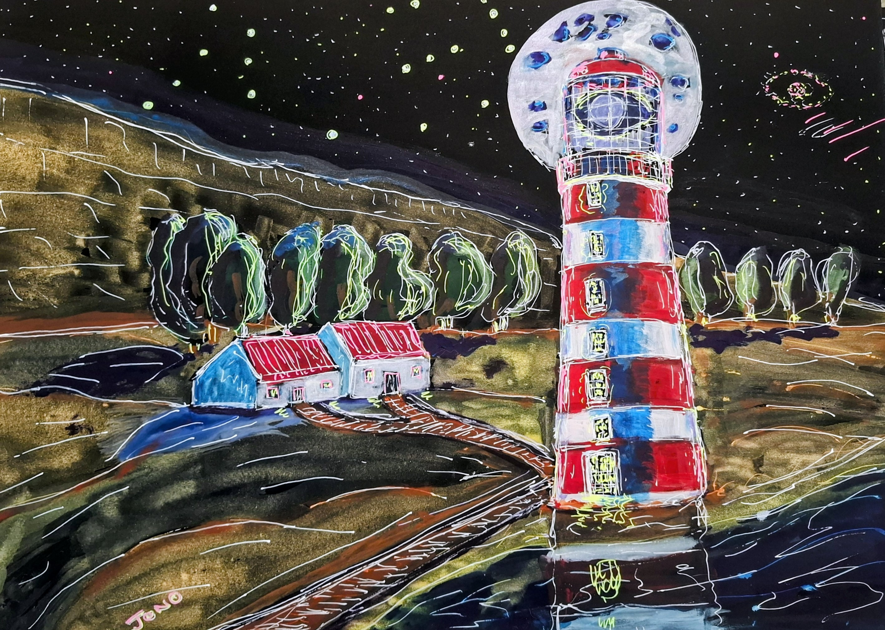

# Lighthouses

Dunnets Head Lighthouse

{ .story-img loading=lazy }

Light Attraction

{ .story-img loading=lazy }

Pollinating Light

{ .story-img loading=lazy }

LightHouse

{ .story-img loading=lazy }

A Lighthouse to Know Where

{ .story-img loading=lazy }

I have painted the same building five times without meaning to. It started as a building. It did not stay one.

*Dunnets Head Lighthouse* is the one that was actually there. Caithness, the top corner of the Scottish mainland, and the light sitting behind a drystone wall that takes up half the picture. I painted it the way I found it: grey stone, cold sea, muted, the gulls in the right place. There is no invention in it, and that was not what it was for. It is the reference. Everything after it is what happens once you stop looking at the thing and start using it.

*Light Attraction* is the first departure. A lighthouse at night, red and yellow, and the air around it thick with grasshoppers coming in on the beam. Underneath, on the sand, the ones that already came. Husks in colour piled up around the base, a clock hanging melted in a tree on the right, one small figure standing in the doorway watching it happen. The light does its job perfectly. It is visible for miles and everything that sees it comes. That is the problem with being a beacon. You do not get to choose what you attract, and the things that arrive are not always saved by arriving.

*Pollinating Light* takes the same idea and makes it agricultural. A poppy field running to the horizon, and every poppy has a lighthouse growing out of its centre where the stamens should be. Bees work the field, moving tower to tower. Striped red, blue, yellow, black, no two the same. This one is my favourite of the group because it turns the lighthouse into a crop. Something cultivated, propagated, deliberately spread. In *Light Attraction* the light draws things in and they die at the foot of it. Here the light is being farmed, and the bees are busy making more of it. Same object, opposite economy.

*LightHouse* is the pun made literal, and I am not going to pretend it is not a pun. A banded tower at night with the full moon sitting directly behind the lamp room, so you cannot say which of the two is doing the lighting. Two keeper's cottages below with red roofs and the windows lit yellow, a track running up to the door. It is drawn in white pen over dark washes, so the picture is line on black rather than paint on white, which is the reverse of how I usually work. The title is a house made of light, or a lighthouse made into a home, and the painting declines to settle it. Someone lives there. That is the part people forget. A lighthouse is a warning to everybody else and an address to one family.

*A Lighthouse to Know Where* is the last of them, and it belongs to the Know Where series as much as to this one. The pilgrim walks a boardwalk across a field of stones toward the light on the headland, the saucer clouds massed low over the hills, and he is the only colour in a black and white drawing. A lighthouse is the honest version of a destination. It is not the end of the journey. It tells you where you are, warns you off the rocks, and then you keep going.

Five pictures, one building, and what keeps changing is what I want from it. A record. A trap. A crop. A home. A mark to steer by. The lighthouse is worth painting because it is the rare structure that is entirely about other people. It exists to be seen from somewhere else, by someone who is not there yet. Nobody builds one for the view from the top.

