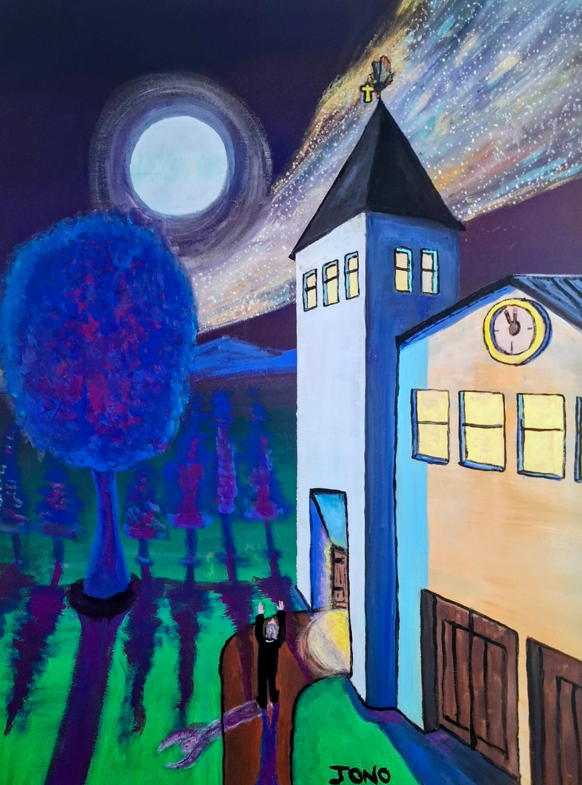

# Called to Prayer

McGregor NG Kerk

{ .story-img loading=lazy width="1931" height="2630" }

Rotterdam, Saint Alexander Nevsky

{ .story-img loading=lazy width="3213" height="2278" }

The Hague, Nieuwe Kerk

{ .story-img loading=lazy width="2835" height="2033" }

Ancienne Mosquée du Vendredi Badjanani

{ .story-img loading=lazy width="2915" height="2057" }

The Pilgrimage to Know Where

{ .story-img loading=lazy width="2560" height="1887" }

The Pilgrimage to Know Where Too

{ .story-img loading=lazy width="2296" height="3278" }

The Last Holiday, Amsterdam

{ .story-img loading=lazy width="3006" height="2244" }

A Starling's Reformation at Five to Midnight

{ .story-img loading=lazy width="2190" height="2952" }

Eight of these have gone up on the wall over the years, in four countries and across four traditions, and I have never once painted the inside of any of them. That is not a policy. I only noticed it when I put them next to each other, and then it stopped looking like an accident. Every one of these buildings was built to call somebody in. Every time, I have painted the call and stopped there.

*McGregor NG Kerk* is the one nearest home and the boldest of them. Yellow walls, white gable, a clock tower with the face painted black, red trees banked up on either side and a hedge of green. An orange path runs from the bottom of the sheet straight up the middle to the door. Then the lower half of the picture is the whole church again, upside down in water. In a village where I paint every building flat on because that is how the road meets it, the kerk is the one thing the road actually points at, and it gets the full treatment.

*Rotterdam* is the Orthodox Church of Saint Alexander Nevsky, a Russian building with a gold onion dome sitting in a Dutch park behind bare trees. Same device as McGregor without me planning it. Paved path, handrail, straight to the door, and the dome doing the work a spire does, which is to tell you where the building is from further away than you can read a sign.

The *Nieuwe Kerk* in The Hague is the humblest and I like it for that. Octagonal under a slate roof with a small clock lantern on top, hemmed in on both sides by flats that are two hundred years younger and completely unbothered by it. The path curves to the door this time rather than running at it, and there are daffodils shoved up against the bottom edge of the sheet. The building has been absorbed by an ordinary neighbourhood and nobody has made a monument of it.

The mosque breaks the pattern, and it breaks it in the most interesting way. The *Ancienne Mosquée du Vendredi Badjanani* in Moroni is the furthest away I have ever placed one of these buildings. The white arcades and the minaret sit as a thin band across the top of the sheet, behind a sea wall, and the entire foreground is boats. Wooden hulls, exposed ribs, a whole harbour of them worked in more detail than the mosque itself. There is no path in this one because there is water in the way. You cannot walk up to it, so the picture is about the distance instead, and I lettered the name across the top corner in my own hand because that was the only way in I had.

Then the two drawings, where the approach stops being a detail and becomes the entire subject. In *The Pilgrimage to Know Where* the cathedral is one building among several around a square, the mountains still visible behind it, and the pilgrim standing in the open with the option of going anywhere. In *The Pilgrimage to Know Where Too* the town has closed in, the street is narrow, and every line in the drawing runs to the cathedral door at the end of it. He has no choices left. That is what a nave does to a person, done to a street. There is a seventh, and it is the sharpest example of the lot. The black spire at the left edge of *The Last Holiday* belongs to the Sint-Augustinuskerk on Nieuwendammerdijk, and the side of it facing the Grote Die is the back. The door is round the other side, on the dijk, along with the path and the frontage and everything the building does to draw a person towards it. None of that is in my painting. I set up across the water, put a magpie over the spire, and painted the elevation the church does not use.

So: two kerks, an Orthodox church, a Protestant parish church, a Catholic one, a Friday mosque and two cathedrals, and not one interior among them. I do not think that is squeamishness. These buildings are machines for calling people towards a door. The tower announces the position, the dome does it from further out, the minaret does it in a human voice five times a day, and the avenue and the path and the narrow street do the pulling once you are close. All of it is designed and all of it works. I have stood in front of them and felt it work. What I have painted, every time, is the last place you can stand and still be outside, and then I have set up there and stayed.

*A Starling's Reformation at Five to Midnight* is the eighth, and it is the one where the subject stops being architecture. Another village kerk at night. White tower, black spire, four windows lit yellow, a clock on the gable with both hands nearly closed at the top. A full moon with a ring round it, a band of stars pouring across the sky, blue trees throwing purple shadows the whole length of the grass. There is a path, because with me there is always a path. A man in black with white hair is standing on it with both arms raised, and he is not at the door. He is out on the open ground doing the thing the building exists to produce, and doing it where the building cannot take the credit.

And above him, on the cross at the top of the spire, sits a starling. It has the highest point of the whole structure, above the clock and above the man, and it did not come up the path to get there. That is the reformation. No schism, no new doctrine, no argument with anybody. One bird on the roof of the institution at five to midnight, keeping none of the hours, called by nothing, and already exactly where everyone else is trying to get.

