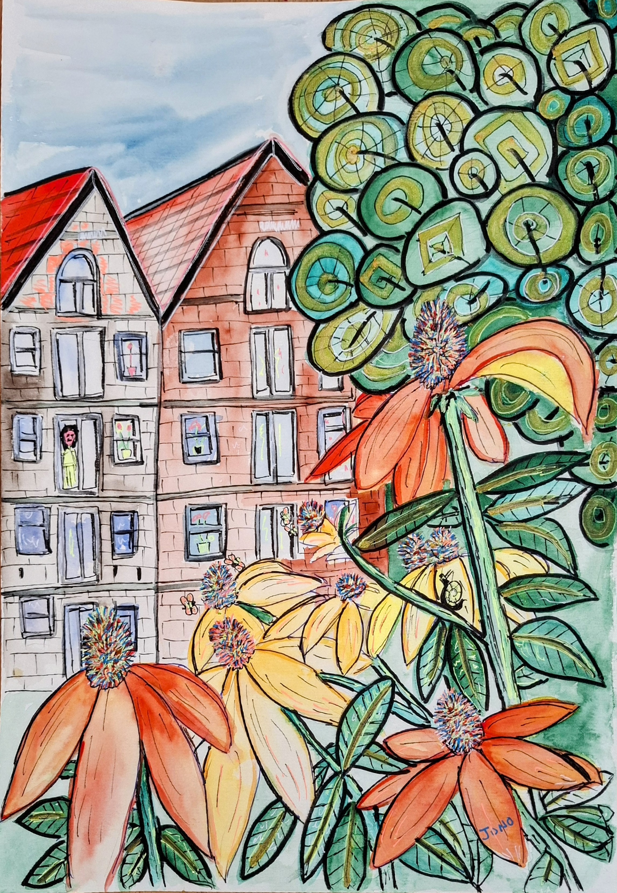
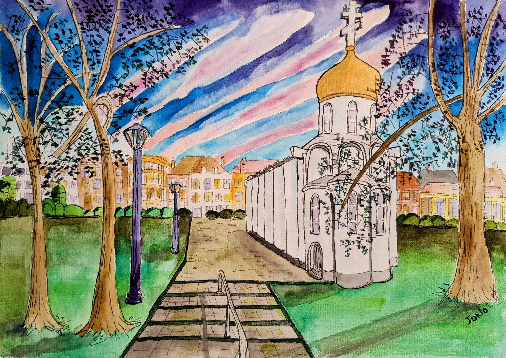

# The Netherlands

The Last Holiday, Amsterdam

{ .story-img loading=lazy }

Cafe T'Sluisje

{ .story-img loading=lazy }

Amsterdam

{ .story-img loading=lazy }

Amsterdam (canal houses)

{ .story-img loading=lazy }

Rotterdam, Saint Alexander Nevsky

{ .story-img loading=lazy }

The Hague, Nieuwe Kerk

{ .story-img loading=lazy }

Catching the Cold in Amsterdam

{ .story-img loading=lazy }

Seven pictures came back from the Netherlands and not one of them is the Netherlands you would recognise from a brochure. No tulip field, no windmill, no Rijksmuseum, no bicycle leaning artfully against a bridge with the light doing something. I have looked at the group as a set and what strikes me is how local it all is. This is a country I was standing in, not a country I was touring.

*The Last Holiday* has its own story elsewhere and I will not repeat it here, except to say it sets the address. The Grote Die in Amsterdam Noord, seen from where we were staying. Everything else in the group is within walking distance of it or a train ride from it, which is the honest radius of most holidays.

*Cafe T'Sluisje* is at the bottom of that walk, at the foot of the same water, and the painting is not a record of the building. The real one is white and black, a proper brown pub, dark inside and not looking for anyone's approval. In the watercolour it is pink and blue under an orange tiled roof with the windows lit warm in the middle of the day. That is the method and not a mistake. I replace the palette with the one the place had while I was in it, and a good pub on a cold afternoon is not the colour of its paintwork. What I did keep is all the hardware. The folded parasol, the steps, the railings, the flat wall of the bridge coming in from the left, and the bicycles racked along the quay drawn one at a time. The name means the little lock. The Dutch put a great deal of engineering into being able to sit somewhere pleasant with a drink, and the picture is mostly the engineering, painted in the wrong colours on purpose.

The *Amsterdam* watercolour is where the departure gets obvious. The gabled houses are there, correctly proportioned, a woman leaning out of an upstairs window, and then the front half of the sheet is taken over by coneflowers the size of the buildings. Orange and yellow petals, dark spiked centres, a bee, leaves running off the edge. The flowers were real and they were not that big. They are that big in the painting because that is the order I noticed things in, and the painting is allowed to record attention rather than measurement.

The ink drawing of the canal houses is the opposite decision, and it is the one I am most pleased with. No colour anywhere. A whole quay of gables and warehouse fronts drawn in line, a barge and two moored boats, saucer clouds sitting over the roofs, and then the bottom third given entirely to the reflection, the same buildings pulled into vertical strokes in the water. Those clouds turn up again in the Know Where drawings, so the sheet is more connected to the rest of my work than it looks. There is no figure in colour in this one. Nobody is walking through it. It is a place drawn from across the water, which is where you stand in Amsterdam whether you plan to or not.

*Rotterdam* is the perverse one and I know it. Rotterdam is a city of cube houses, a great swan of a bridge and a skyline it earned the hard way, and what I painted is the Orthodox Church of Saint Alexander Nevsky, a small Russian church with a gold onion dome, standing in a park behind bare trees with a paved path leading up to it. It is a short walk from the Depot Boijmans Van Beuningen, the mirrored salad bowl that half the city ends up photographing itself in. So I stood with the most photographed building in Rotterdam behind me and painted the one nobody had mentioned. That is not contrarian, it is just what happened. The dome caught the light under a striped pink and blue sky and I stopped walking, and the bowl did not stop me, and the painting records which of those two things is true rather than which one is famous.

*The Hague* does the same again with better manners. It is the Nieuwe Kerk, octagonal under a slate roof with a small clock lantern on top, hemmed in on both sides by ordinary flats, a path curving to the door, and daffodils shoved right up against the bottom edge of the sheet with blossom coming in red from the left. It is spring and the picture is nearly all garden. The building is old, the buildings around it are not, and nobody has made a feature of the fact. That is very Dutch, and it is why the painting works.

Then there is the self-portrait, which is called *Catching the Cold in Amsterdam* and contains no Amsterdam at all. A man in a red beanie with a Liver bird on it, a padded jacket, white earphone cable, a grey beard, green pine mountains behind, and a night sky with a full moon, stars, a comet and a rocket going up on the left. There are no mountains in Amsterdam and there is no space programme. All that is genuinely from the trip is the cold, the hat and the headphones.

Which is the closest thing to a conclusion the group offers. A holiday does not leave you with a country. It leaves you with the pond you looked at every morning, the cafe at the end of the road, flowers that were bigger than the houses that day, one gold dome in the wrong city, and how you felt standing outside in the cold with your music on. The tulips manage perfectly well without me.

