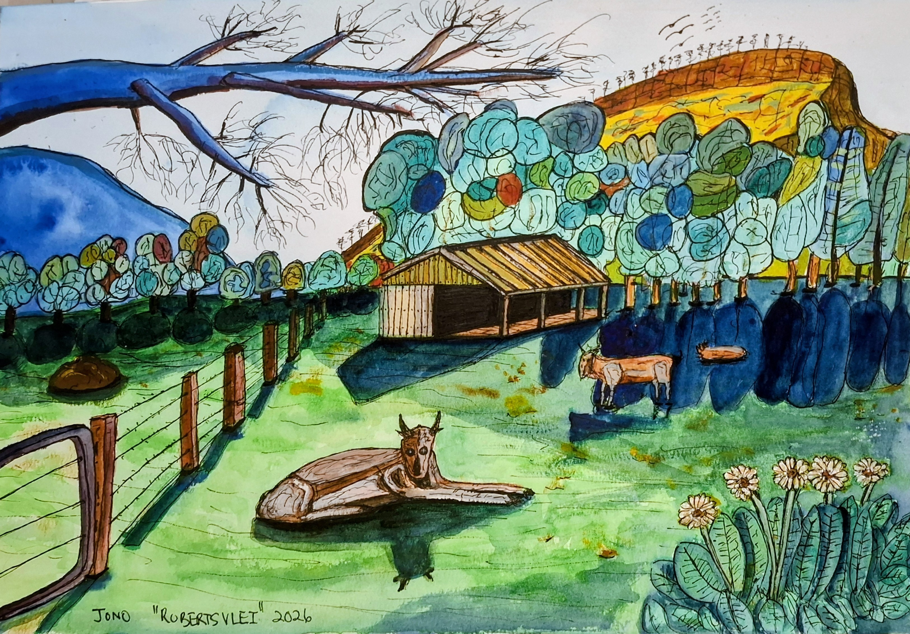
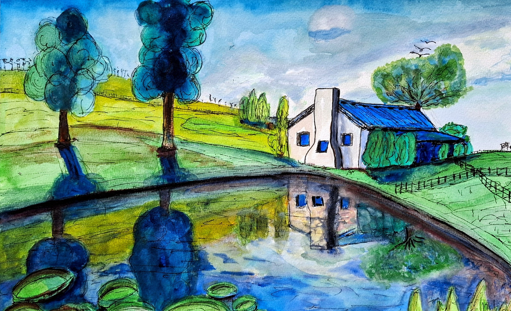

# The Villages

Suurbraak

{ .story-img loading=lazy width="2519" height="1877" }

Suurbraak (one)

{ .story-img loading=lazy width="3327" height="2296" }

Suurbraak (three)

{ .story-img loading=lazy width="2708" height="1771" }

McGregor

{ .story-img loading=lazy width="2673" height="1842" }

McGregor NG Kerk

{ .story-img loading=lazy width="1931" height="2630" }

22 on Church

{ .story-img loading=lazy width="3214" height="2288" }

Montagu

{ .story-img loading=lazy width="3083" height="2106" }

Swellendam

{ .story-img loading=lazy width="3180" height="2296" }

R62, Prickly Pear Farm

{ .story-img loading=lazy width="2811" height="2010" }

Robertsvlei

{ .story-img loading=lazy width="3251" height="2268" }

Hemelsbreed

{ .story-img loading=lazy width="3107" height="1895" }

I have painted the same small group of villages for years, and I paint them the same way every time. Straight on. Front of the building, flat to the picture, no clever angle and nothing receding into a corner. It took me a while to notice I was doing it, and longer to work out why.

Suurbraak is where it started, and it is the one I keep going back to. The acrylic is the loudest version: a white cottage under a red corrugated roof, all of it sitting behind a wall of flowers so thick you cannot reach the front door. That is not what the place looks like. That is what it feels like to arrive there in a good month, and the flowers get the front of the picture because the flowers are what you actually take in.

The watercolours of the same village are quieter and more honest about the detail. One of them has a pitchfork propped by the door, a plant on the sill, a number 5 on the gatepost, and a man at the window looking straight out at whoever is painting him. He is the whole picture. A house with a face in the window is not a study of architecture any more, it is somebody's house, and you are standing in the road outside it. The other one runs a longer cottage front across the sheet with two doors and shrubs climbing between them, and behind it the hills go up in flat bands of green and ochre. That is the shape of the place. A row of fronts, then farmland, then mountains, then nothing.

McGregor is the argument in miniature. Blue and white striped verandah on white columns, potted plants along a red stoep, doors standing open, parking bays painted on the road in the foreground. My own note on it says a village at the end of a road that does not go anywhere else, and that is the accurate description. You do not pass through McGregor. You choose it, you arrive, and then you turn round and come back out the way you went in. The shopfront is painted the way you meet it, from the parking bay, dead on.

The church is the exception that proves it. McGregor NG Kerk is the one building in the village nobody meets side on, so I gave it the full frontal treatment, yellow walls and a clock tower and red trees either side. Then the bottom half of the picture is the whole church again, upside down in water. I have done that more than once without planning to. Swellendam is the same move on a bigger building: a two storey Victorian arcade with the shop signs still legible, and below the kerb line the entire facade repeated in the wet road, with a STOP marking running backwards through it. Hemelsbreed puts the farmhouse in its own dam. The reflection is where I let the accuracy go. The building has to be right. The version of it in the water can be as loose as I like, and it usually says more.

22 on Church is the only one that is properly about people, and it is lit from inside. A restaurant at night in Montagu, green striped awning, the big number on the wall, and every window full. Diners at their tables, a waiter carrying a plate, the opening hours written on a piece of paper stuck to the glass. I painted it from outside, standing in the street, which is exactly where you are when a restaurant looks like that. The Montagu cottage next to it does the same job in daylight: shuttered windows, two panelled doors, bougainvillea threaded through the verandah frame, and the mountains reduced to two ochre humps behind the roof.

The farms are where the frontal habit breaks. Prickly Pear Farm has proper depth for once, the werf up on its rise with the labourers' cottages, the long red barn and the jacarandas, and then rank after rank of prickly pear marching down the field towards you. Robertsvlei is looser again, a barn beside the water with the cattle worked up close and a dead branch cutting across the top of the sheet. Once you are on the farm you can walk round things, so the pictures let you.

That is the whole of it. I paint the villages flat on because that is the only view the road gives you. These are places built along a single line, one road in, the same road out, and every building on it presents a face to the traffic because the traffic is the reason the building is there. You cannot walk round the back of a village you are driving through. What you get is a front, a window with someone in it, and a puddle that shows you the whole thing again on the way past.

