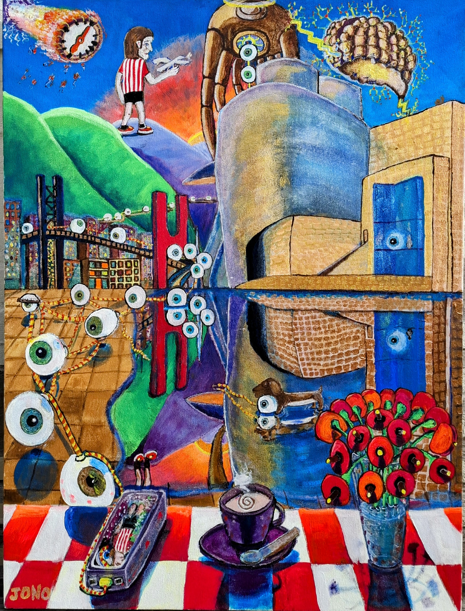

# Stories

Every painting starts with a photograph. I shoot architecture and landscapes, mostly. Buildings with presence, water that holds light, skylines that frame a place. The camera captures the scene. Then the painting departs from it.

The colours shift first. Muted stone becomes cadmium red. A grey sky fills with cerulean and gold. I am not correcting the photograph. I am replacing its palette with something closer to how the place felt, or how I wanted it to feel. Accuracy is the camera's job. The painting gets to be something else.

Then the scene itself changes. Details that were peripheral in the photograph move to the centre. A bird I saw but did not shoot. A sculpture from the other side of the building. Flowers that were three streets away. The painting becomes a composite of the whole visit, not a single frame from it. Things that caught my eye find their way in, whether the lens saw them or not.

The result is a version of a real place that never quite existed. Familiar enough to recognise, different enough to look twice.

---

[{ .gallery-img loading=lazy width="2649" height="1853" }](Cantabrian%20Mountains/index.md)

**Cantabrian Mountains, Espinosa de los Monteros**

1000 × 750 mm · Acryla Gouache · Canvas
{ .card-medium }

[{ .gallery-img loading=lazy width="3006" height="2244" }](The%20Last%20Holiday/index.md)

**The Last Holiday, Amsterdam**

1000 × 750 mm · Acryla Gouache · Canvas
{ .card-medium }

[{ .gallery-img loading=lazy width="2560" height="1887" }](The-Road-to-Know-Where/index.md)

**The Know Where Series**

Acryla Gouache · Ink & Watercolour
{ .card-medium }

[{ .gallery-img loading=lazy width="3266" height="2291" }](Lighthouses/index.md)

**Lighthouses**

Watercolour · Ink & Watercolour
{ .card-medium }

[{ .gallery-img loading=lazy width="2296" height="3014" }](Guggenheim/index.md)

**Guggenheim, Bilbao**

750 × 1000 mm · Acryla Gouache · Canvas
{ .card-medium }

[{ .gallery-img loading=lazy width="2155" height="2874" }](The%20Insect%20Hotel/index.md)

**The Grand Insect Hotel**

750 × 1000 mm · Acryla Gouache · Canvas
{ .card-medium }

[{ .gallery-img loading=lazy width="2890" height="1779" }](Aeromechanica/index.md)

**Aeromechanica**

Watercolour · Vellum · Acryla Gouache
{ .card-medium }

[{ .gallery-img loading=lazy width="2673" height="1842" }](The%20Villages/index.md)

**The Villages**

Watercolour · Acryla Gouache
{ .card-medium }

[{ .gallery-img loading=lazy width="2296" height="3323" }](The%20Netherlands/index.md)

**The Netherlands**

Watercolour · Ink · Acryla Gouache
{ .card-medium }

[{ .gallery-img loading=lazy width="1931" height="2630" }](Standing%20Outside/index.md)

**Called to Prayer**

Watercolour · Ink & Watercolour · Acrylic
{ .card-medium }

---

<a href="https://www.facebook.com/jonathan.charles.gill/" target="_blank"><i class="fa-brands fa-facebook"></i> Facebook</a>
<a href="https://www.instagram.com/jonathangi11/" target="_blank"><i class="fa-brands fa-instagram"></i> Instagram</a>

