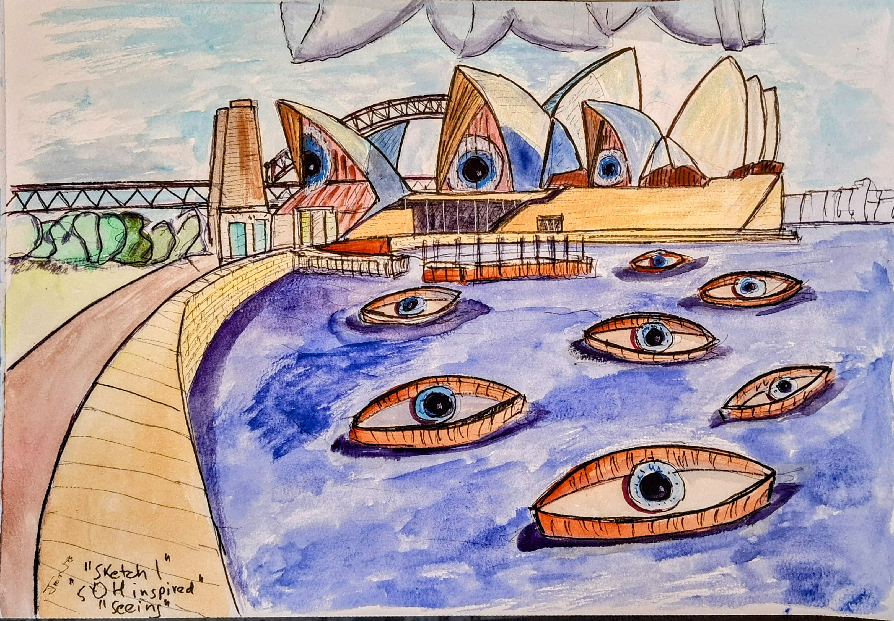

# Surreal

I start with what I see and what I hear. Then I paint, and the painting starts making its own decisions. Colours push harder, geometry tightens, and what was a real place becomes something that was always hiding inside it.

---

{ .gallery-img }

**A Black Hole in the Kitchen**

Acryla Gouache · Canvas
{ .card-medium }

Inspired by "Not Strong Enough" by Boy Genius.

{ .gallery-img }

**Avis Aeromechanica Chocolatus**

1000mm x 750mm · Acryla Gouache · Canvas
{ .card-medium }

A bird plane powered by chocolate, built from watercolour blueprints. Part avian, part mechanical, fully impractical.

[Read the story](stories/Avis%20Aeromechanica%20Chocolatus/index.md){ .card-story-link }

{ .gallery-img }

**Hot Air Play**

1000mm x 750mm · Acryla Gouache · Canvas
{ .card-medium }

Fantasy world viewed from hot air.

{ .gallery-img }

**Libellula Aviatica**

762mm x 1016mm · Acryla Gouache · Canvas
{ .card-medium }

A dragonfly reimagined as a flying machine. The Aeromechanica idea, now with six legs and four wings.

{ .gallery-img }

**The Global Peace Conference**

Acryla Gouache · Canvas
{ .card-medium }

The Universe coming together to sort out the world, and get it to peace.

{ .gallery-img }

**The Grand Insect Hotel**

750mm x 1000mm · Acryla Gouache · Canvas
{ .card-medium }

The official painting commemorating [The Insect Hotel](https://theinsecthotel.co.za).

[Read the story](stories/The%20Insect%20Hotel/index.md){ .card-story-link }

{ .gallery-img }

**The Love Vending Machine**

1500mm x 2000mm · Acryla Gouache · Canvas
{ .card-medium }

Channelling the positive energy of the Universe into human endeavours.

{ .gallery-img }

**The Path**

1000mm x 750mm · Acryla Gouache · Canvas
{ .card-medium }

A path to the Moon.

---

{ .gallery-img }

**A Light House**

A3 · Watercolour · 300gsm Hot Press Paper
{ .card-medium }

Attracted to the light.

{ .gallery-img }

**Aeromechanica (side profile)**

A3 · Watercolour · 300gsm Hot Press Paper
{ .card-medium }

A biomechanical plane — eco-friendly.

{ .gallery-img }

**Aeromechanica (top profile)**

A3 · Watercolour · 300gsm Hot Press Paper
{ .card-medium }

A biomechanical plane — eco-friendly.

{ .gallery-img }

**Aeromechanica Chocolatus Cockpit**

Watercolour and ink · Paper
{ .card-medium }

The control panel of the Chocolatus. Emergency feeding, migration urges, thermal regulation, bird brain, flightGPT and Foodec, all marshalled from here.

{ .gallery-img }

**Avis Aeromechanica Avronis**

A3 · Watercolour · 300gsm Hot Press Paper
{ .card-medium }

A bird grafted onto an Avro airframe. Part avian, part British aviation.

{ .gallery-img }

**Avis Aeromechanica Crabro**

A3 · Watercolour · 300gsm Hot Press Paper
{ .card-medium }

A bird wearing hornet stripes. The taxonomy keeps slipping.

{ .gallery-img }

**Black Hole in the Kitchen**

A3 · Watercolour · 300gsm Hot Press Paper
{ .card-medium }

Inspired by "Not Strong Enough" by Boy Genius.

{ .gallery-img }

**Black Hole in the Lounge**

A3 · Watercolour · 300gsm Hot Press Paper
{ .card-medium }

Pushing the inspiration into new rooms. Black Hole in the Bathroom may be next.

{ .gallery-img }

**Brain Scan**

A3 · Watercolour · 300gsm Hot Press Paper
{ .card-medium }

Brain scans help you feel better, maybe?

{ .gallery-img }

**Culex Aeromechanica De Havillandii**

A3 · Watercolour · 300gsm Hot Press Paper
{ .card-medium }

A mosquito reworked as a De Havilland. Another from the Aeromechanica series.

{ .gallery-img }

**Eye Field**

A3 · Watercolour · 300gsm Hot Press Paper
{ .card-medium }

Who is checking out the world?

{ .gallery-img }

**Light Attraction**

A3 · Watercolour · 300gsm Hot Press Paper
{ .card-medium }

Attracted to the light.

{ .gallery-img }

**LightHouse**

A3 · Watercolour · 300gsm Hot Press Paper
{ .card-medium }

A house made of light, or a lighthouse made into a home.

{ .gallery-img }

**Listening**

A3 · Watercolour · 300gsm Hot Press Paper
{ .card-medium }

With all our technology, who is really listening?

{ .gallery-img }

**Music Poppy**

A3 · Watercolour · 300gsm Hot Press Paper
{ .card-medium }

{ .gallery-img }

**Sir Real**

A3 · Watercolour · 300gsm Hot Press Paper
{ .card-medium }

A watercolour pun made visible.

{ .gallery-img }

**Sydney Opera House**

A3 · Watercolour · 300gsm Hot Press Paper
{ .card-medium }

The Opera House reimagined.

{ .gallery-img }

**The Passage**

A3 · Watercolour · 300gsm Hot Press Paper
{ .card-medium }

{ .gallery-img }

**To The Light 3**

A3 · Watercolour · 300gsm Hot Press Paper
{ .card-medium }

Attracted to the light.

---

<a href="https://www.facebook.com/jonathan.charles.gill/" target="_blank"><i class="fa-brands fa-facebook"></i> Facebook</a>
<a href="https://www.instagram.com/jonathangi11/" target="_blank"><i class="fa-brands fa-instagram"></i> Instagram</a>

