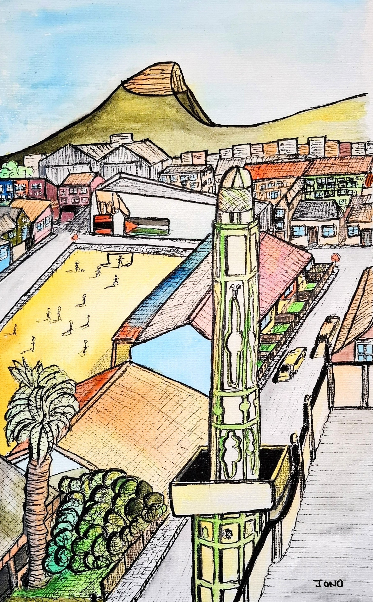
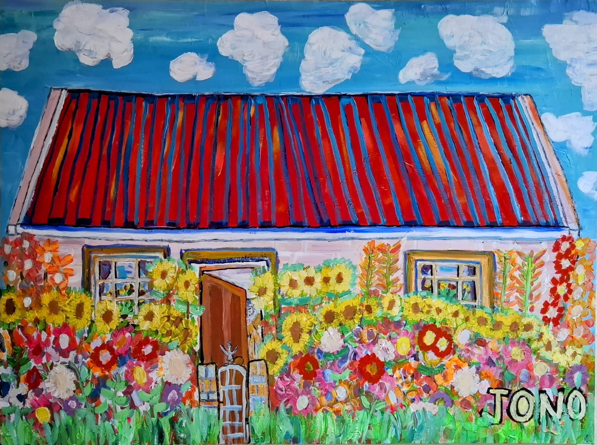
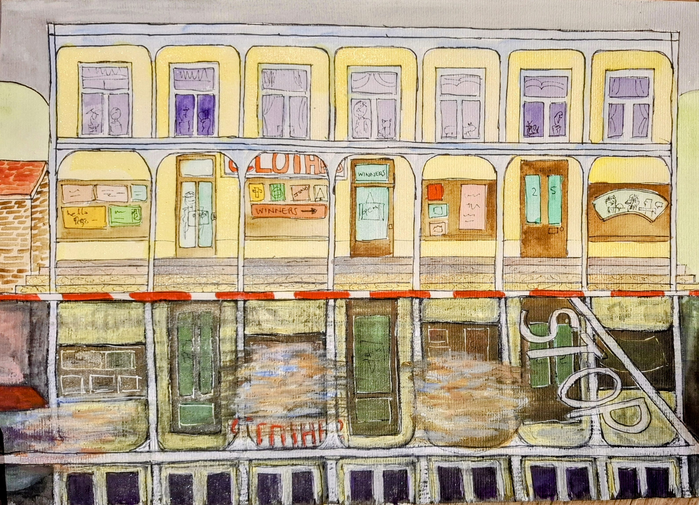
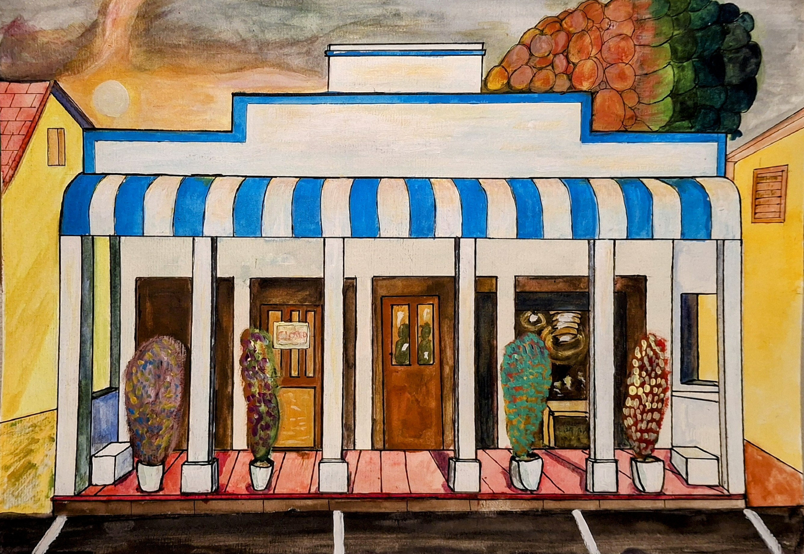
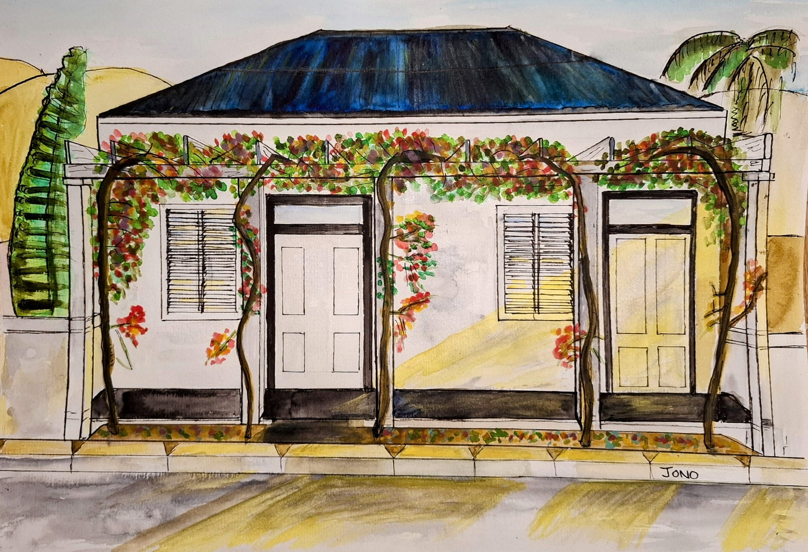
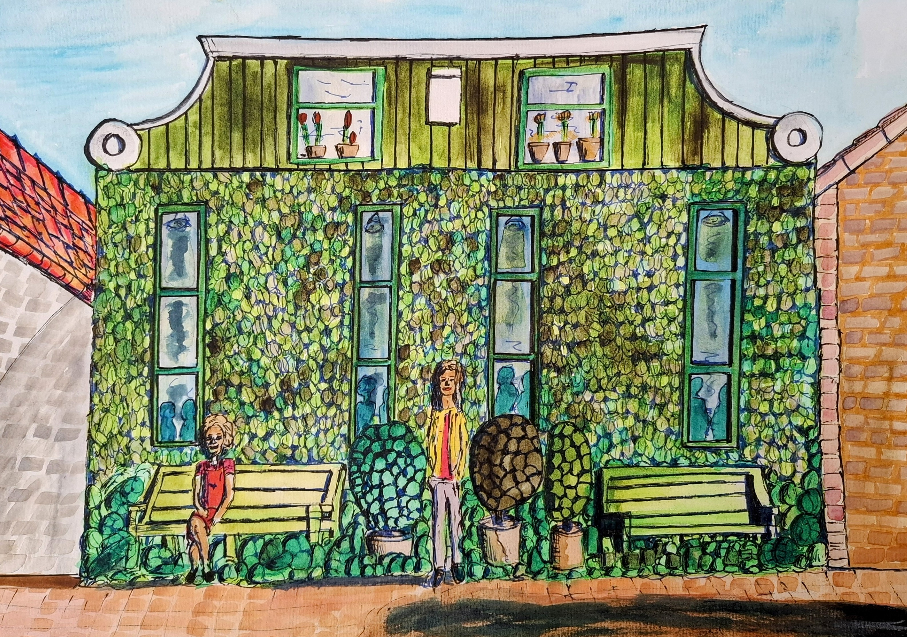
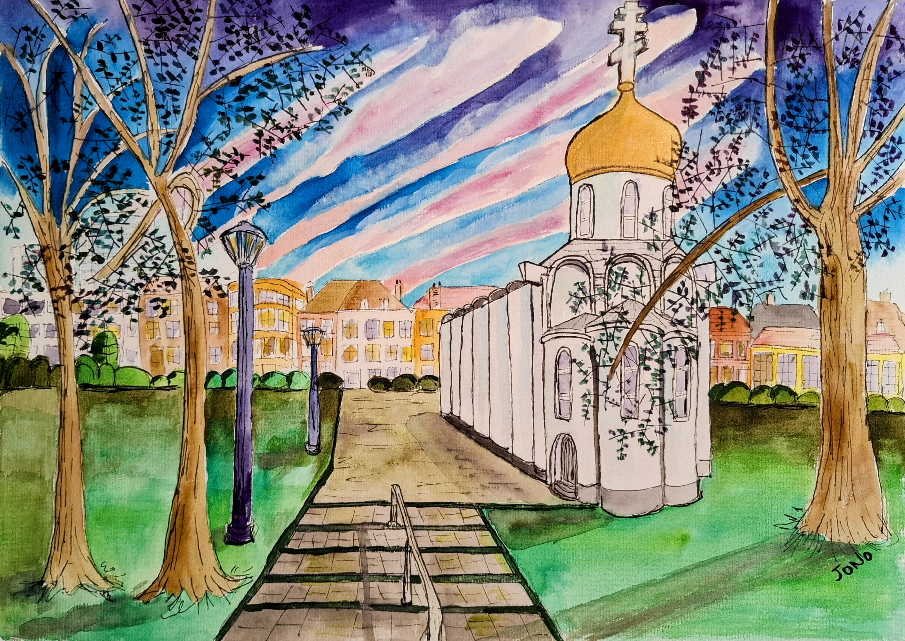
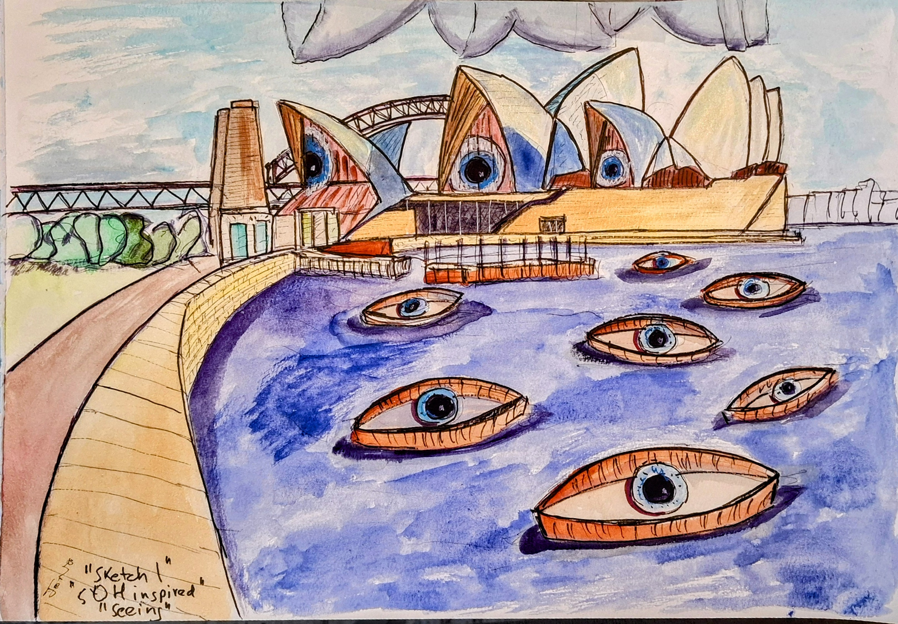
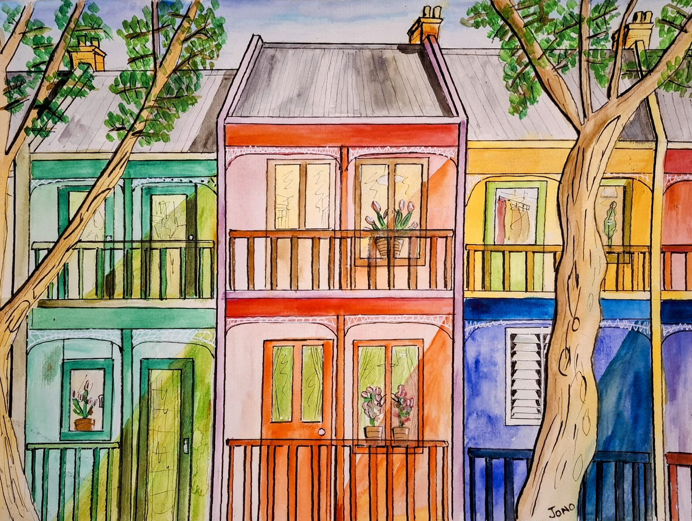
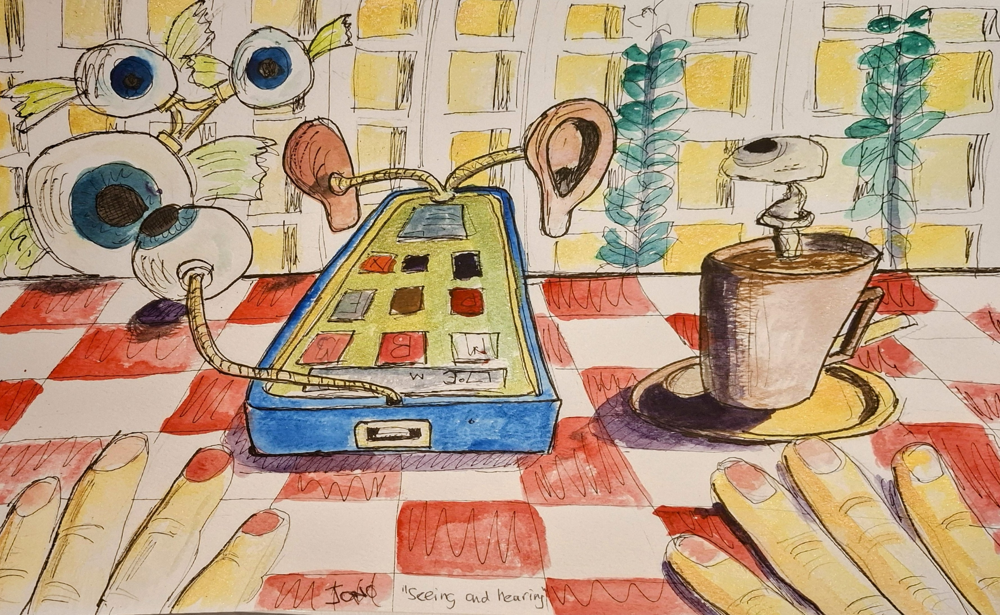

# Watercolours

## Cape Town & Surrounds

---

{ .gallery-img }

**St James**

---

{ .gallery-img }

**Simons Town 1**

---

{ .gallery-img }

**Simons Town 2**

---

{ .gallery-img }

**Bo-Kaap**

---

{ .gallery-img }

**Woodstock**

---

{ .gallery-img }

**Lavenders, Franschhoek**

## Western Cape Towns

---

{ .gallery-img }

**Suurbraak**

---

{ .gallery-img }

**Suurbraak 1**

---

{ .gallery-img }

**Suurbraak 2**

---

{ .gallery-img }

**Suurbraak 3**

---

{ .gallery-img }

**Suurbraak 4**

---

{ .gallery-img }

**Suurbraak 5**

---

{ .gallery-img }

**Swellendam**

---

{ .gallery-img }

**McGregor**

---

{ .gallery-img }

**Montagu**

## Europe

---

{ .gallery-img }

**Amsterdam**

---

{ .gallery-img }

**Amsterdam 2**

---

{ .gallery-img }

**Rotterdam**

---

{ .gallery-img }

**The Hague**

## Landscapes

---

{ .gallery-img }

**Dunnets Head**

---

{ .gallery-img }

**The Passage**

---

{ .gallery-img }

**SOH**

## Surreal

---

{ .gallery-img }

**Black Hole in the Kitchen**

---

{ .gallery-img }

**Black Hole in the Lounge**

---

{ .gallery-img }

**Sir Real**

---

{ .gallery-img }

**Aero Mechanica**

---

{ .gallery-img }

**Brain Scan**

---

{ .gallery-img }

**Ultima**

## Portraits & Figures

---

{ .gallery-img }

**Listening**

---

{ .gallery-img }

**Me 2**

